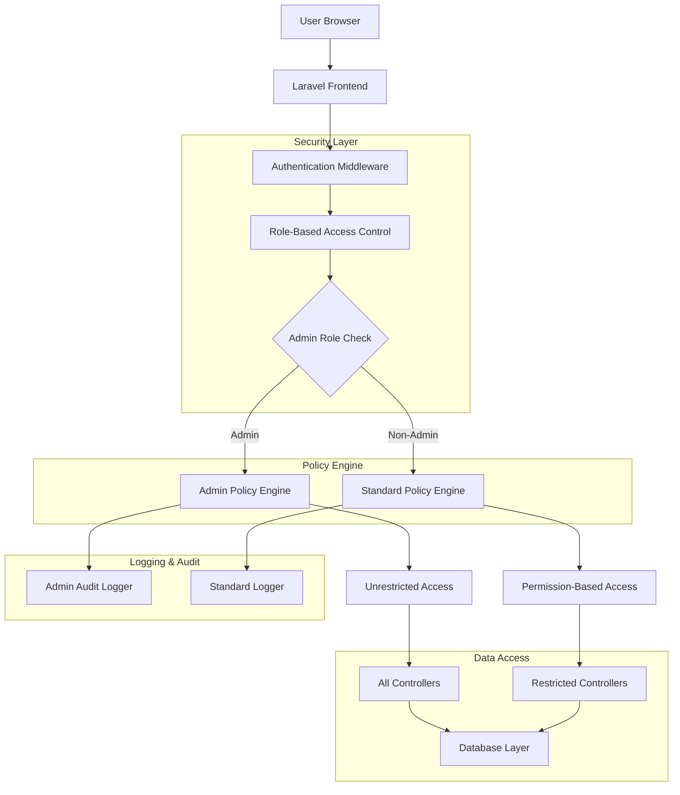
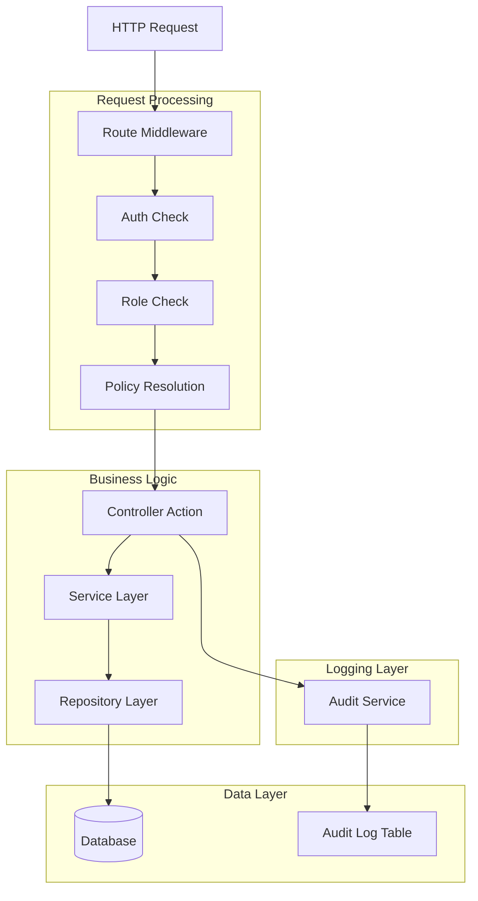
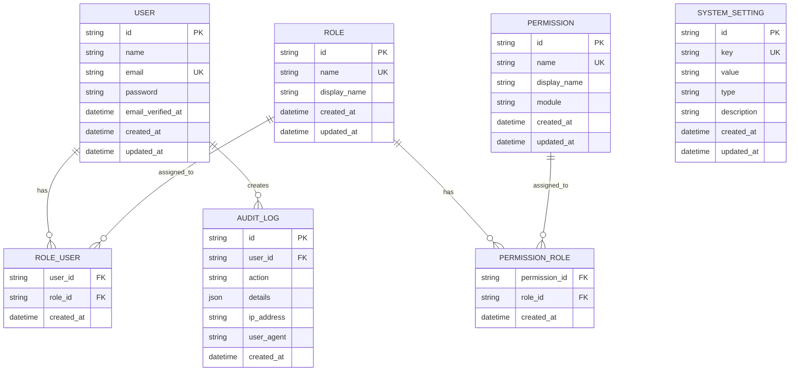

# Admin Role System - Technical Architecture Document

## 1. Architecture Design



## 2. Technology Description

### 2.1 Backend Framework
- **Framework**: Laravel 11.x
- **Language**: PHP 8.2+
- **Authentication**: Laravel Sanctum (for API) + Session-based (for web)
- **Authorization**: Laravel Policies + Gates + Custom Blade Directives

### 2.2 Database
- **Primary Database**: PostgreSQL 14+
- **UUID Generation**: Native PostgreSQL UUID generation
- **Migration System**: Laravel Migrations with UUID support

### 2.3 Frontend
- **Template Engine**: Blade with Laravel UI components
- **CSS Framework**: Bootstrap 5.3
- **JavaScript**: Vanilla JavaScript with jQuery for DataTables
- **Icons**: Font Awesome 6.x

### 2.4 Security Components
- **Hashing**: bcrypt for passwords
- **CSRF Protection**: Laravel built-in CSRF tokens
- **Session Security**: Encrypted sessions with secure configuration
- **Audit Logging**: Custom audit trail implementation

## 3. Route Definitions

### 3.1 Admin-Specific Routes
| Route | Purpose | Middleware |
|-------|---------|------------|
| `/admin/users` | User management interface | `auth`, `role:admin` |
| `/admin/users/create` | Create new user | `auth`, `role:admin` |
| `/admin/users/{user}/edit` | Edit user | `auth`, `role:admin` |
| `/admin/roles` | Role management | `auth`, `role:admin` |
| `/admin/permissions` | Permission management | `auth`, `role:admin` |
| `/admin/settings` | System settings | `auth`, `role:admin` |
| `/admin/audit-logs` | Audit log viewer | `auth`, `role:admin` |
| `/admin/system-info` | System information | `auth`, `role:admin` |

### 3.2 Enhanced Existing Routes (Admin Override)
| Route | Enhanced Admin Access | Standard Access |
|-------|----------------------|-----------------|
| `/instansi` | Full CRUD + bulk operations | Based on role |
| `/program` | Full CRUD + all data access | Based on role |
| `/kegiatan` | Full CRUD + all data access | Based on role |
| `/indikator-kinerja` | Full CRUD + all data access | Based on role |
| `/laporan-kinerja` | Full CRUD + all data access | Based on role |

## 4. API Definitions

### 4.1 Admin User Management API

#### Create User
```
POST /api/admin/users
```

Request:
```json
{
  "name": "New User",
  "email": "user@example.com",
  "password": "securepassword",
  "roles": ["admin", "manager"],
  "permissions": ["manage_programs"]
}
```

Response:
```json
{
  "id": "uuid-here",
  "name": "New User",
  "email": "user@example.com",
  "roles": ["admin", "manager"],
  "created_at": "2024-01-01T00:00:00Z"
}
```

#### Update User Roles
```
PUT /api/admin/users/{user}/roles
```

Request:
```json
{
  "roles": ["manager"],
  "permissions": ["manage_programs", "manage_kegiatans"]
}
```

### 4.2 Admin System API

#### System Statistics
```
GET /api/admin/system/stats
```

Response:
```json
{
  "total_users": 150,
  "total_roles": 5,
  "total_permissions": 25,
  "active_sessions": 45,
  "system_load": 0.23,
  "database_size": "125MB"
}
```

#### Audit Logs
```
GET /api/admin/audit-logs
```

Response:
```json
{
  "data": [
    {
      "id": "uuid-here",
      "user_id": "user-uuid",
      "action": "user.created",
      "details": {"user_id": "new-user-uuid"},
      "ip_address": "192.168.1.1",
      "user_agent": "Mozilla/5.0...",
      "created_at": "2024-01-01T00:00:00Z"
    }
  ],
  "total": 1000,
  "per_page": 20
}
```

## 5. Server Architecture Diagram



## 6. Data Model

### 6.1 Enhanced Database Schema



### 6.2 Data Definition Language (DDL)

#### Audit Logs Table
```sql
CREATE TABLE audit_logs (
    id UUID PRIMARY KEY DEFAULT gen_random_uuid(),
    user_id UUID NOT NULL REFERENCES users(id) ON DELETE CASCADE,
    action VARCHAR(100) NOT NULL,
    details JSONB DEFAULT '{}',
    ip_address INET,
    user_agent TEXT,
    created_at TIMESTAMP WITH TIME ZONE DEFAULT NOW()
);

CREATE INDEX idx_audit_logs_user_id ON audit_logs(user_id);
CREATE INDEX idx_audit_logs_action ON audit_logs(action);
CREATE INDEX idx_audit_logs_created_at ON audit_logs(created_at DESC);
```

#### System Settings Table
```sql
CREATE TABLE system_settings (
    id UUID PRIMARY KEY DEFAULT gen_random_uuid(),
    key VARCHAR(255) UNIQUE NOT NULL,
    value TEXT,
    type VARCHAR(50) DEFAULT 'string' CHECK (type IN ('string', 'integer', 'boolean', 'json')),
    description TEXT,
    created_at TIMESTAMP WITH TIME ZONE DEFAULT NOW(),
    updated_at TIMESTAMP WITH TIME ZONE DEFAULT NOW()
);

CREATE INDEX idx_system_settings_key ON system_settings(key);
```

#### Enhanced Permissions Table
```sql
ALTER TABLE permissions ADD COLUMN module VARCHAR(50);
ALTER TABLE permissions ADD COLUMN description TEXT;

CREATE INDEX idx_permissions_module ON permissions(module);
```

## 7. Policy Implementation

### 7.1 Enhanced Admin Policy
```php
<?php

namespace App\Policies;

use App\Models\User;
use App\Models\Program;

class ProgramPolicy
{
    public function before(User $user, string $ability): ?bool
    {
        // Admin override - bypass all other checks
        if ($user->hasRole('admin')) {
            return true;
        }
        
        return null; // Continue with normal policy checks
    }
    
    // Existing policy methods remain the same
    public function viewAny(User $user): bool
    {
        return true; // any authenticated user
    }
    
    public function view(User $user, Program $program): bool
    {
        return true; // any authenticated user
    }
    
    public function create(User $user): bool
    {
        return $user->hasAnyRole(['admin', 'manager']);
    }
    
    public function update(User $user, Program $program): bool
    {
        return $user->hasAnyRole(['admin', 'manager']);
    }
    
    public function delete(User $user, Program $program): bool
    {
        return $user->hasRole('admin');
    }
}
```

### 7.2 Admin User Policy
```php
<?php

namespace App\Policies;

use App\Models\User;

class UserPolicy
{
    public function viewAny(User $user): bool
    {
        return $user->hasRole('admin');
    }
    
    public function view(User $user, User $model): bool
    {
        return $user->hasRole('admin');
    }
    
    public function create(User $user): bool
    {
        return $user->hasRole('admin');
    }
    
    public function update(User $user, User $model): bool
    {
        return $user->hasRole('admin');
    }
    
    public function delete(User $user, User $model): bool
    {
        // Prevent admin from deleting themselves
        return $user->hasRole('admin') && $user->id !== $model->id;
    }
    
    public function manageRoles(User $user, User $model): bool
    {
        return $user->hasRole('admin');
    }
}
```

## 8. Service Layer Implementation

### 8.1 Admin Service
```php
<?php

namespace App\Services;

use App\Models\User;
use App\Models\Role;
use App\Models\Permission;
use App\Models\AuditLog;

class AdminService
{
    public function createUser(array $data): User
    {
        $user = User::create([
            'name' => $data['name'],
            'email' => $data['email'],
            'password' => bcrypt($data['password']),
        ]);
        
        if (isset($data['roles'])) {
            $this->assignRoles($user, $data['roles']);
        }
        
        $this->logAction('user.created', ['user_id' => $user->id]);
        
        return $user;
    }
    
    public function assignRoles(User $user, array $roleNames): void
    {
        $roles = Role::whereIn('name', $roleNames)->get();
        $user->roles()->sync($roles);
        
        $this->logAction('user.roles.updated', [
            'user_id' => $user->id,
            'roles' => $roleNames
        ]);
    }
    
    public function logAction(string $action, array $details = []): void
    {
        AuditLog::create([
            'user_id' => auth()->id(),
            'action' => $action,
            'details' => $details,
            'ip_address' => request()->ip(),
            'user_agent' => request()->userAgent(),
        ]);
    }
}
```

## 9. Security Implementation

### 9.1 Enhanced Authentication
```php
// In LoginController
public function login(Request $request)
{
    $credentials = $request->validate([
        'email' => ['required', 'email'],
        'password' => ['required'],
    ]);
    
    if (Auth::attempt($credentials, $request->boolean('remember'))) {
        $user = Auth::user();
        
        // Additional admin security check
        if ($user->hasRole('admin')) {
            // Log admin login
            app(AdminService::class)->logAction('admin.login', [
                'ip' => $request->ip(),
                'user_agent' => $request->userAgent()
            ]);
            
            // Consider additional MFA requirement here
        }
        
        $request->session()->regenerate();
        return redirect()->intended(route('dashboard'));
    }
    
    return back()->withErrors([
        'email' => 'Email atau password salah.',
    ])->onlyInput('email');
}
```

### 9.2 Admin Middleware
```php
<?php

namespace App\Http\Middleware;

use Closure;
use Illuminate\Http\Request;

class AdminMiddleware
{
    public function handle(Request $request, Closure $next)
    {
        if (!auth()->check() || !auth()->user()->hasRole('admin')) {
            abort(403, 'Unauthorized access - Admin role required');
        }
        
        // Log admin access
        app(AdminService::class)->logAction('admin.access', [
            'route' => $request->route()->getName(),
            'method' => $request->method()
        ]);
        
        return $next($request);
    }
}
```

## 10. Performance Optimization

### 10.1 Database Optimization
- Index optimization for role and permission queries
- Caching layer for frequently accessed permissions
- Query optimization for admin data retrieval
- Connection pooling for high-concurrency scenarios

### 10.2 Caching Strategy
- Role and permission caching
- Admin dashboard data caching
- System settings caching
- Audit log aggregation caching

### 10.3 Monitoring and Alerting
- Performance monitoring for admin operations
- Security event monitoring
- System health monitoring
- Automated alerting for suspicious activities

This technical architecture provides a robust, secure, and scalable foundation for implementing the comprehensive admin role system while maintaining the existing application's integrity and performance.