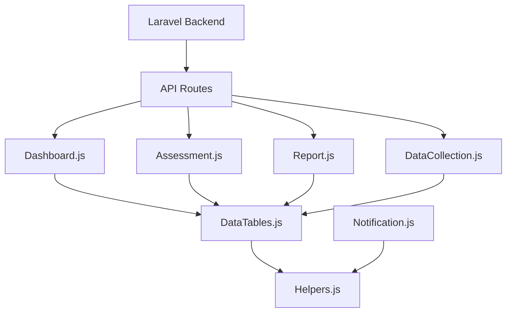
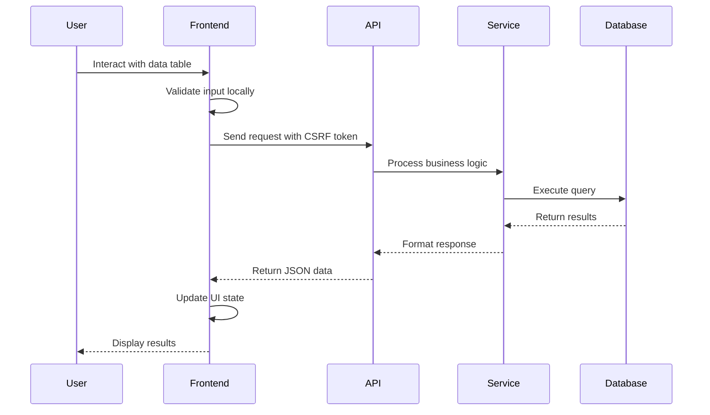

# Laravel Application Integration Plan

## 1. Current Application Architecture Analysis

### 1.1 Technology Stack
- **Backend**: Laravel 12.0 with PHP 8.2+
- **Frontend**: React components with Laravel Blade templates
- **Database**: SQLite (development) with PostgreSQL support
- **Build Tool**: Vite with Laravel Vite Plugin
- **Styling**: TailwindCSS 4.0
- **JavaScript**: ES6+ modules with custom SAKIP components

### 1.2 Existing Components Inventory

#### Backend Components
- **Models**: 15+ models including User, Role, Permission, Assessment, PerformanceIndicator, etc.
- **Controllers**: SAKIP-specific controllers with comprehensive CRUD operations
- **Services**: 15+ service classes for business logic separation
- **Policies**: Role-based access control with 12 policy classes
- **Middleware**: Authentication and authorization middleware
- **Database**: 20+ migrations with proper relationships

#### Frontend Components
- **JavaScript Modules**: 
  - `data-tables.js` - Advanced data table system (1,188 lines)
  - `assessment.js` - Assessment functionality
  - `audit-trail.js` - Audit logging
  - `dashboard.js` - Dashboard components
  - `data-collection.js` - Data collection interface
  - `helpers.js` - Utility functions
  - `notification.js` - Notification system
  - `report.js` - Report generation

- **CSS Styles**:
  - Government-style responsive design
  - Accessibility-compliant styling
  - Print-optimized stylesheets
  - Component-specific styles

#### React Components
- **Pages**: TypeScript-based React components in `resources/js/Pages/`
- **Integration**: React components integrated with Laravel backend

### 1.3 Current Architecture Patterns
- **Service Layer Pattern**: Business logic separated into service classes
- **Repository Pattern**: Data access abstraction
- **Policy-based Authorization**: Fine-grained permission system
- **Event-driven Architecture**: Custom event system in JavaScript
- **UMD Module Pattern**: Universal module definition for JavaScript

## 2. Integration Points and Dependencies

### 2.1 Frontend-Backend Integration
- **API Routes**: RESTful endpoints in `routes/api_sakip.php`
- **AJAX Endpoints**: Real-time data updates
- **CSRF Protection**: Laravel CSRF tokens integrated
- **Authentication**: Session-based with Laravel Sanctum ready

### 2.2 Component Dependencies


### 2.3 Service Integration Points
- **PerformanceCalculationService**: Integrates with data tables for real-time calculations
- **ReportGenerationService**: Exports data from table components
- **DataValidationService**: Validates input before table updates
- **NotificationService**: Notifies users of table state changes

## 3. Code Consistency Guidelines

### 3.1 Laravel Best Practices
- **PSR-4 Autoloading**: Proper namespace structure
- **Service Container**: Dependency injection throughout
- **Eloquent ORM**: Consistent model relationships
- **Migration Naming**: Descriptive migration names
- **Route Naming**: Consistent route naming conventions
- **Blade Templates**: Component-based structure

### 3.2 JavaScript Standards
- **ES6+ Modules**: Modern JavaScript syntax
- **JSDoc Comments**: Comprehensive documentation
- **Error Handling**: Try-catch blocks with user-friendly messages
- **Event System**: Consistent event naming and handling
- **Data Validation**: Client-side validation before submission

### 3.3 Code Organization
```
app/
├── Http/
│   ├── Controllers/
│   │   ├── Sakip/          # SAKIP-specific controllers
│   │   └── Admin/           # Admin controllers
│   ├── Middleware/
│   ├── Requests/            # Form request validation
│   └── Resources/           # API resources
├── Models/
├── Policies/
├── Services/
│   ├── Sakip/              # SAKIP business logic
│   └── Admin/              # Admin services
└── Providers/

resources/
├── js/
│   ├── sakip/              # SAKIP JavaScript modules
│   ├── Pages/              # React components
│   └── app.js              # Main JavaScript entry
├── css/
│   └── sakip-styles.css     # SAKIP-specific styles
└── views/
    ├── layouts/            # Blade layouts
    ├── sakip/              # SAKIP views
    └── admin/              # Admin views
```

## 4. Integration Implementation Strategy

### 4.1 Asset Pipeline Integration
- **Vite Configuration**: Optimize for production builds
- **Code Splitting**: Separate vendor and application code
- **Caching Strategy**: Implement proper cache headers
- **CDN Integration**: Serve static assets via CDN

### 4.2 API Integration
- **RESTful Design**: Consistent API structure
- **Response Format**: Standardized JSON responses
- **Error Handling**: Consistent error codes and messages
- **Rate Limiting**: Implement API throttling
- **Authentication**: Token-based authentication ready

### 4.3 Data Flow Integration


## 5. Laravel Best Practices Implementation

### 5.1 Security Measures
- **Input Validation**: Form request validation classes
- **SQL Injection Prevention**: Eloquent ORM usage
- **XSS Prevention**: Blade escaping and CSP headers
- **CSRF Protection**: Token validation on all forms
- **Authorization**: Policy-based access control
- **Audit Logging**: Comprehensive audit trail

### 5.2 Performance Optimization
- **Eager Loading**: Prevent N+1 queries
- **Query Optimization**: Indexed database queries
- **Caching Strategy**: Redis for session and data caching
- **Asset Optimization**: Minified and compressed assets
- **Database Indexing**: Proper index strategy
- **Queue System**: Background job processing

### 5.3 Code Quality
- **SOLID Principles**: Single responsibility and dependency inversion
- **Design Patterns**: Repository, Service, and Factory patterns
- **Testing Strategy**: Unit and feature tests
- **Code Documentation**: PHPDoc and inline comments
- **Error Handling**: Custom exception classes
- **Logging**: Structured logging with context

## 6. Testing Strategy

### 6.1 Unit Testing
- **Model Tests**: Relationship and scope testing
- **Service Tests**: Business logic validation
- **Policy Tests**: Authorization rule testing
- **Helper Tests**: Utility function testing

### 6.2 Feature Testing
- **API Endpoint Tests**: Request/response validation
- **Authentication Tests**: Login and permission tests
- **Data Flow Tests**: End-to-end data processing
- **Integration Tests**: Component interaction testing

### 6.3 Frontend Testing
- **JavaScript Tests**: Module functionality testing
- **UI Tests**: Component rendering and interaction
- **Accessibility Tests**: WCAG compliance testing
- **Cross-browser Tests**: Browser compatibility

## 7. Performance Optimization

### 7.1 Database Optimization
- **Query Optimization**: Analyze and optimize slow queries
- **Index Strategy**: Strategic index placement
- **Connection Pooling**: Database connection management
- **Read Replicas**: Scale read operations

### 7.2 Frontend Optimization
- **Bundle Size**: Code splitting and tree shaking
- **Lazy Loading**: On-demand component loading
- **Image Optimization**: WebP format and responsive images
- **CDN Usage**: Global asset distribution

### 7.3 Caching Strategy
- **Page Caching**: Full-page caching for static content
- **Fragment Caching**: Partial content caching
- **Query Caching**: Database query result caching
- **Session Caching**: Session data optimization

## 8. Deployment and Maintenance

### 8.1 Deployment Strategy
- **Environment Configuration**: Staged deployment process
- **Database Migrations**: Zero-downtime migrations
- **Asset Compilation**: Automated build pipeline
- **Health Checks**: Application health monitoring

### 8.2 Monitoring and Logging
- **Application Monitoring**: Performance and error tracking
- **Database Monitoring**: Query performance analysis
- **Security Monitoring**: Unauthorized access detection
- **User Analytics**: Usage pattern analysis

### 8.3 Maintenance Procedures
- **Regular Updates**: Security patch management
- **Backup Strategy**: Automated backup procedures
- **Performance Review**: Regular performance audits
- **Security Audit**: Periodic security assessments

## 9. Migration Plan

### 9.1 Phase 1: Foundation (Week 1-2)
- Set up development environment
- Configure Vite and asset pipeline
- Implement basic authentication
- Create base layouts and components

### 9.2 Phase 2: Core Integration (Week 3-4)
- Integrate data tables with backend
- Implement API endpoints
- Add role-based access control
- Create service layer integration

### 9.3 Phase 3: Advanced Features (Week 5-6)
- Add advanced filtering and sorting
- Implement export functionality
- Create dashboard components
- Add notification system

### 9.4 Phase 4: Testing and Optimization (Week 7-8)
- Comprehensive testing suite
- Performance optimization
- Security audit
- Documentation completion

This integration plan ensures seamless integration of all existing SAKIP components while maintaining Laravel best practices and preserving current functionality. The approach is systematic, scalable, and follows industry standards for enterprise-level applications.