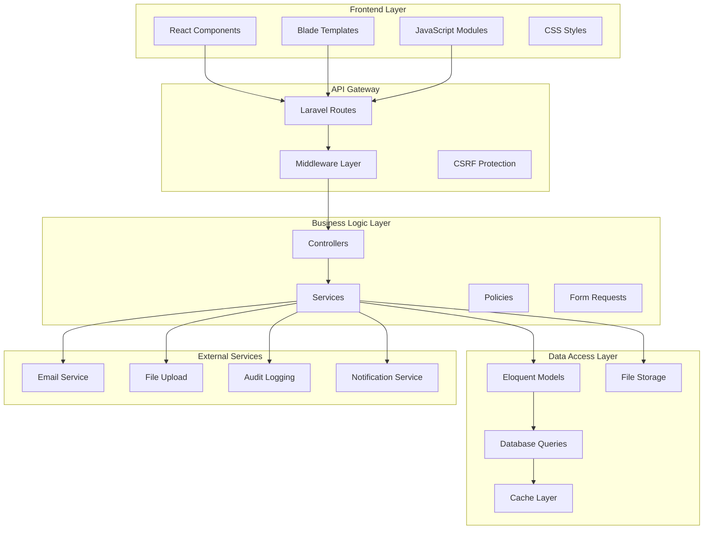
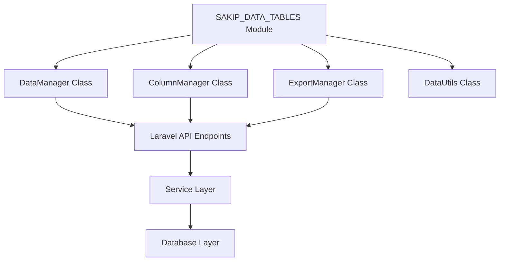
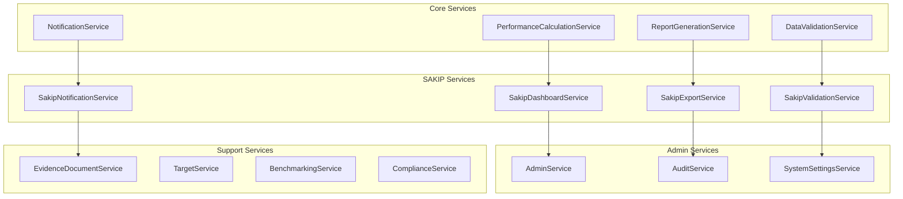
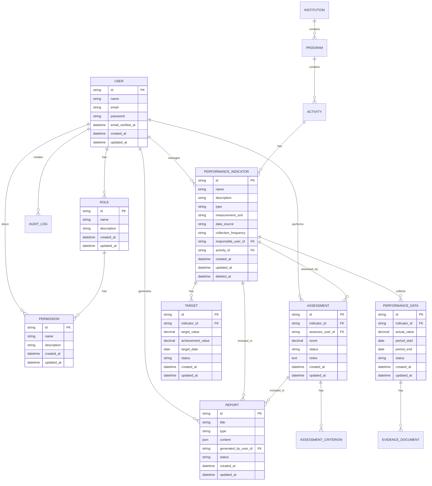
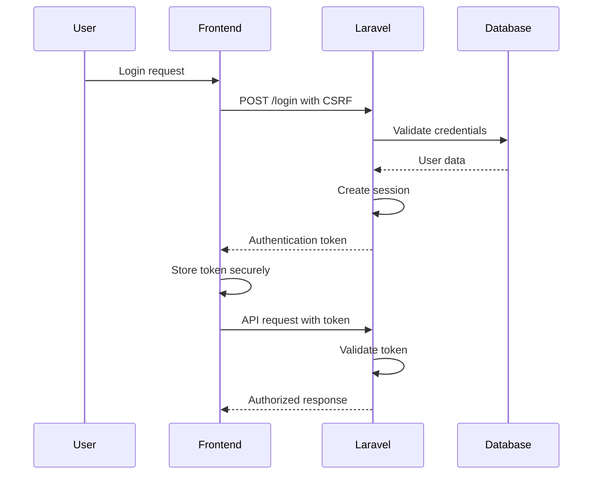
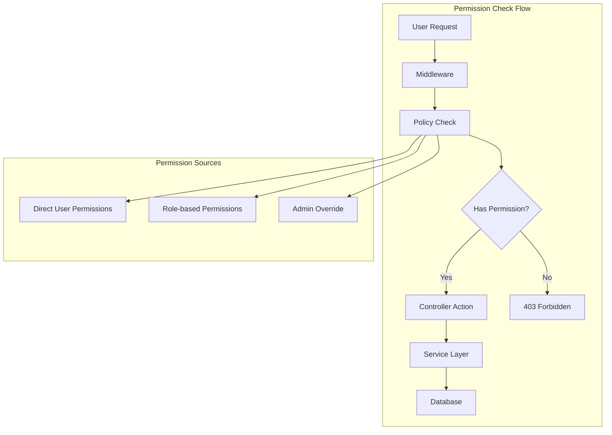
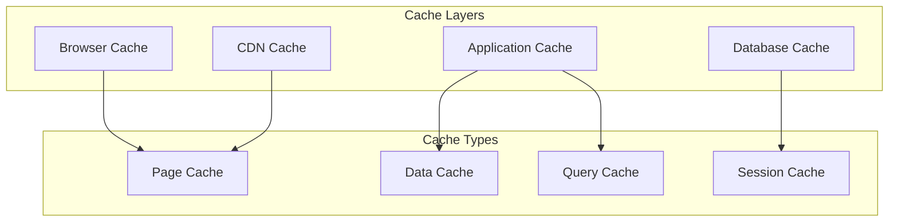
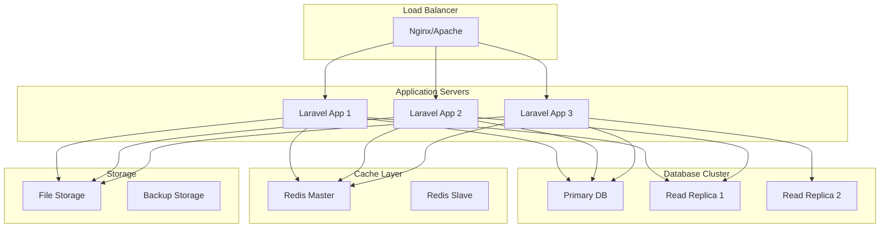

# Laravel Integration Technical Architecture

## 1. Architecture Overview

### 1.1 System Architecture


### 1.2 Technology Stack
- **Backend Framework**: Laravel 12.0
- **PHP Version**: 8.2+
- **Database**: SQLite (development), PostgreSQL (production)
- **Frontend**: React 18 + TypeScript
- **Build Tool**: Vite 7.0
- **Styling**: TailwindCSS 4.0
- **JavaScript**: ES6+ modules
- **Authentication**: Laravel Sanctum ready
- **Caching**: Redis support
- **Queue**: Laravel Queue with Redis

## 2. Component Integration Architecture

### 2.1 Data Tables Integration


### 2.2 Service Layer Architecture


## 3. Database Architecture

### 3.1 Entity Relationship Diagram


### 3.2 Database Schema Definitions

#### Users Table
```sql
CREATE TABLE users (
    id UUID PRIMARY KEY DEFAULT gen_random_uuid(),
    name VARCHAR(255) NOT NULL,
    email VARCHAR(255) UNIQUE NOT NULL,
    email_verified_at TIMESTAMP NULL,
    password VARCHAR(255) NOT NULL,
    remember_token VARCHAR(100) NULL,
    created_at TIMESTAMP DEFAULT CURRENT_TIMESTAMP,
    updated_at TIMESTAMP DEFAULT CURRENT_TIMESTAMP
);
```

#### Performance Indicators Table
```sql
CREATE TABLE performance_indicators (
    id UUID PRIMARY KEY DEFAULT gen_random_uuid(),
    name VARCHAR(255) NOT NULL,
    description TEXT,
    type VARCHAR(50) NOT NULL,
    measurement_unit VARCHAR(50),
    data_source VARCHAR(255),
    collection_frequency VARCHAR(50),
    responsible_user_id UUID REFERENCES users(id),
    activity_id UUID REFERENCES activities(id),
    created_at TIMESTAMP DEFAULT CURRENT_TIMESTAMP,
    updated_at TIMESTAMP DEFAULT CURRENT_TIMESTAMP,
    deleted_at TIMESTAMP NULL
);
```

## 4. API Architecture

### 4.1 RESTful API Design
```mermaid
graph LR
    subgraph "API Routes"
        A[GET /api/sakip/indicators]
        B[POST /api/sakip/indicators]
        C[GET /api/sakip/indicators/{id}]
        D[PUT /api/sakip/indicators/{id}]
        E[DELETE /api/sakip/indicators/{id}]
    end

    subgraph "Controller Actions"
        F[index()]
        G[store()]
        H[show()]
        I[update()]
        J[destroy()]
    end

    subgraph "Service Methods"
        K[getAllIndicators()]
        L[createIndicator()]
        M[getIndicatorById()]
        N[updateIndicator()]
        O[deleteIndicator()]
    end

    A --> F
    B --> G
    C --> H
    D --> I
    E --> J
    F --> K
    G --> L
    H --> M
    I --> N
    J --> O
```

### 4.2 API Response Format
```json
{
    "success": true,
    "data": {
        "id": "uuid",
        "name": "Indicator Name",
        "description": "Indicator Description",
        "type": "quantitative",
        "measurement_unit": "percentage",
        "targets": [],
        "performance_data": []
    },
    "meta": {
        "timestamp": "2025-01-01T00:00:00Z",
        "version": "1.0"
    }
}
```

### 4.3 Error Response Format
```json
{
    "success": false,
    "error": {
        "code": "VALIDATION_ERROR",
        "message": "The given data was invalid.",
        "details": {
            "name": ["The name field is required."],
            "type": ["The type field must be one of: quantitative, qualitative."]
        }
    },
    "meta": {
        "timestamp": "2025-01-01T00:00:00Z"
    }
}
```

## 5. Frontend Integration Architecture

### 5.1 JavaScript Module System
```javascript
// Module structure
const SAKIP_DATA_TABLES = {
    DataManager,
    ColumnManager,
    ExportManager,
    DataUtils,
    Constants: DATA_TABLE_CONSTANTS
};

// UMD Pattern for universal compatibility
(function (root, factory) {
    if (typeof define === 'function' && define.amd) {
        define(['chart.js'], factory);
    } else if (typeof module === 'object' && module.exports) {
        module.exports = factory(require('chart.js'));
    } else {
        root.SAKIP_DATA_TABLES = factory(root.Chart);
    }
}(typeof self !== 'undefined' ? self : this, function (Chart) {
    // Module implementation
    return SAKIP_DATA_TABLES;
}));
```

### 5.2 React Component Integration
```typescript
// React component structure
interface DataTableProps {
    data: any[];
    columns: ColumnConfig[];
    options?: TableOptions;
    onDataChange?: (data: any[]) => void;
}

const DataTable: React.FC<DataTableProps> = ({ data, columns, options, onDataChange }) => {
    const [tableData, setTableData] = useState(data);
    const [filteredData, setFilteredData] = useState(data);
    
    // Integration with SAKIP_DATA_TABLES
    const dataManager = useMemo(() => new SAKIP_DATA_TABLES.DataManager(data, options), [data, options]);
    
    useEffect(() => {
        // Handle data changes
        dataManager.on('dataChanged', (newData) => {
            setTableData(newData);
            onDataChange?.(newData);
        });
    }, [dataManager, onDataChange]);
    
    return (
        <div className="sakip-data-table">
            {/* Table implementation */}
        </div>
    );
};
```

### 5.3 Laravel Blade Integration
```blade
{{-- Blade template integration --}}
@extends('layouts.app')

@section('content')
<div class="container-fluid">
    <div class="card">
        <div class="card-header">
            <h5 class="card-title">Performance Indicators</h5>
        </div>
        <div class="card-body">
            <div id="performance-indicators-table" 
                 data-endpoint="{{ route('sakip.api.indicators.index') }}"
                 data-csrf-token="{{ csrf_token() }}">
            </div>
        </div>
    </div>
</div>
@endsection

@push('scripts')
<script src="{{ asset('js/sakip/data-tables.js') }}"></script>
<script>
    document.addEventListener('DOMContentLoaded', function() {
        const tableElement = document.getElementById('performance-indicators-table');
        const endpoint = tableElement.dataset.endpoint;
        const csrfToken = tableElement.dataset.csrfToken;
        
        // Initialize SAKIP data table
        const dataTable = new SAKIP_DATA_TABLES.DataTable({
            endpoint: endpoint,
            csrfToken: csrfToken,
            columns: [
                { name: 'name', type: 'text', sortable: true },
                { name: 'type', type: 'select', filterable: true },
                { name: 'measurement_unit', type: 'text' },
                { name: 'actions', type: 'actions' }
            ],
            options: {
                pageSize: 10,
                enableExport: true,
                enableFiltering: true
            }
        });
        
        tableElement.appendChild(dataTable.render());
    });
</script>
@endpush
```

## 6. Security Architecture

### 6.1 Authentication Flow


### 6.2 Authorization Architecture


### 6.3 Data Protection
- **Encryption**: Sensitive data encryption at rest
- **HTTPS**: All communications encrypted
- **Input Sanitization**: XSS prevention
- **SQL Injection**: Parameterized queries
- **File Upload Security**: Type and size validation
- **Rate Limiting**: API request throttling

## 7. Performance Architecture

### 7.1 Caching Strategy


### 7.2 Optimization Techniques
- **Database Indexing**: Strategic index placement
- **Query Optimization**: Eager loading and query scopes
- **Asset Optimization**: Minification and compression
- **Lazy Loading**: On-demand resource loading
- **Connection Pooling**: Database connection management
- **Queue Processing**: Background job execution

## 8. Deployment Architecture

### 8.1 Production Environment


### 8.2 Environment Configuration
- **Development**: Local development with SQLite
- **Staging**: Production-like environment
- **Production**: Full cluster with load balancing
- **Monitoring**: Application and server monitoring
- **Logging**: Centralized log aggregation
- **Backup**: Automated backup procedures

This technical architecture provides a comprehensive foundation for integrating all existing SAKIP components with the Laravel application while maintaining scalability, security, and performance standards.