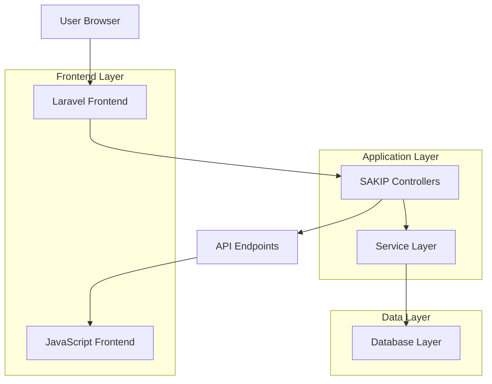

# Laravel SAKIP Integration - Final Technical Documentation

## 1. Project Overview

The SAKIP (Sistem Akuntabilitas Kinerja Instansi Pemerintah) integration represents a comprehensive government accountability and performance management system built on the Laravel framework. This system provides a complete solution for managing performance indicators, data collection, assessments, reporting, and compliance monitoring for government institutions.

**Key Objectives:**
- Streamline government performance accountability processes
- Provide real-time dashboard analytics and reporting
- Enable systematic data collection and assessment workflows
- Ensure compliance with government accountability standards
- Facilitate transparent performance monitoring across institutions

**Target Users:** Government administrators, performance analysts, auditors, and institutional managers requiring comprehensive performance accountability tools.

## 2. Architecture Summary

### System Architecture


### Technology Stack
- **Backend Framework:** Laravel 11.x
- **Frontend Framework:** Blade templating with JavaScript modules
- **Database:** MySQL/PostgreSQL with Eloquent ORM
- **Authentication:** Laravel Sanctum with role-based access control
- **API:** RESTful JSON APIs with comprehensive endpoints
- **Data Visualization:** Chart.js integration for analytics
- **Data Tables:** Custom SAKIP data table implementation

## 3. Implemented Components

### 3.1 Core Service Layer

#### SakipDashboardService
**Location:** `app/Services/Sakip/SakipDashboardService.php`

**Key Methods:**
- `getDashboardData()` - Aggregates all dashboard metrics and charts
- `getMetrics()` - Returns key performance indicators
- `getChartData()` - Provides chart data for visualization
- `getAchievementTrend()` - Calculates performance trends over time
- `getCategoryBreakdown()` - Breaks down performance by categories
- `getInstansiComparison()` - Compares performance across institutions
- `getRecentActivities()` - Retrieves recent system activities
- `getNotifications()` - Fetches user notifications
- `getComplianceStatus()` - Calculates compliance rates
- `getPerformanceSummary()` - Provides overall performance summary

**Error Handling:** All methods include comprehensive try-catch blocks with detailed logging and fallback data.

#### SakipDataTableService
**Location:** `app/Services/Sakip/SakipDataTableService.php`

**Key Methods:**
- `getDataTableConfig()` - Returns data table configurations
- `getData()` - Retrieves filtered and paginated data
- `getIndicatorsData()` - Processes performance indicator data
- `getProgramsData()` - Handles program data retrieval
- `getActivitiesData()` - Manages activity data
- `getReportsData()` - Processes report data
- `formatExportData()` - Formats data for export
- `getExportHeaders()` - Provides export column headers

### 3.2 Controller Layer

#### SakipDashboardController
**Location:** `app/Http/Controllers/Sakip/SakipDashboardController.php`

**Endpoints:**
- `getDashboardData()` - Main dashboard data endpoint
- `getDashboardCharts()` - Chart-specific data endpoint
- `getDashboardKPI()` - KPI metrics endpoint
- `getDashboardNotifications()` - Notifications endpoint
- `getComplianceStatus()` - Compliance status endpoint
- `getComplianceIssues()` - Compliance issues endpoint

#### SakipDataTableController
**Location:** `app/Http/Controllers/Api/Sakip/SakipDataTableController.php`

**Features:**
- Dynamic data table configuration retrieval
- Type-specific data processing (indicators, programs, activities, reports)
- Data export functionality with JSON format
- Comprehensive error handling and validation

### 3.3 Frontend Integration

#### JavaScript Modules
**Location:** `resources/js/sakip/`

**Core Modules:**
- `dashboard.js` - Dashboard management and chart rendering
- `data-tables.js` - Data table implementation
- `helpers.js` - Utility functions
- `notification.js` - Notification handling
- `data-table-init.js` - Data table initialization

**Features:**
- Chart.js integration for data visualization
- Auto-refresh functionality (5-minute intervals)
- Real-time data updates
- Export capabilities (PDF, Excel)
- Responsive design implementation

## 4. API Documentation

### 4.1 Dashboard API Endpoints

| Endpoint | Method | Description |
|----------|---------|-------------|
| `/sakip/api/dashboard-data` | GET | Retrieves complete dashboard data |
| `/sakip/api/dashboard-charts` | GET | Returns chart data for visualization |
| `/sakip/api/dashboard-kpi` | GET | Provides key performance indicators |
| `/sakip/api/dashboard-notifications` | GET | Fetches user notifications |
| `/sakip/api/compliance/status` | GET | Returns compliance status |
| `/sakip/api/compliance/issues` | GET | Lists compliance issues |

### 4.2 Data Table API Endpoints

| Endpoint | Method | Description |
|----------|---------|-------------|
| `/sakip/api/data-table/config/{type}` | GET | Retrieves data table configuration |
| `/sakip/api/data-table/{type}` | GET | Returns filtered and paginated data |
| `/sakip/api/data-table/{type}/export` | GET | Exports data in JSON format |

### 4.3 Core API Endpoints

**Performance Indicators:**
- List, create, update, delete performance indicators
- Target management and tracking
- Performance measurement and analysis

**Data Collection:**
- Bulk data import functionality
- Template download for data entry
- Validation and error handling

**Assessments:**
- Assessment creation and submission
- Verification and approval workflows
- Batch assessment processing

**Reports:**
- Report generation and download
- Template management
- Chart data for visualization

**Audit Trail:**
- Complete audit logging
- Statistics and analytics
- Export functionality

## 5. Frontend Integration Details

### 5.1 Dashboard Implementation

```javascript
// Dashboard initialization and management
class DashboardManager {
    constructor(options = {}) {
        this.options = {
            refreshInterval: 300000, // 5 minutes
            autoRefresh: true,
            chartColors: {
                primary: '#3b82f6',
                secondary: '#10b981',
                success: '#22c55e',
                warning: '#f59e0b',
                danger: '#ef4444',
                info: '#06b6d4'
            },
            ...options
        };
        
        this.charts = new Map();
        this.refreshTimer = null;
        this.isRefreshing = false;
        
        this.init();
    }
}
```

### 5.2 Chart Integration

- **Chart.js Integration:** Full integration with Chart.js for responsive, interactive charts
- **Chart Types:** Bar charts, line charts, pie charts, and custom visualizations
- **Real-time Updates:** Automatic chart updates when new data arrives
- **Responsive Design:** Charts adapt to different screen sizes

### 5.3 Data Table Features

- **Server-side Processing:** Efficient handling of large datasets
- **Filtering and Search:** Advanced filtering capabilities
- **Sorting:** Multi-column sorting with data type awareness
- **Export:** Data export in multiple formats
- **Responsive:** Mobile-friendly table layouts

## 6. Service Layer Overview

### 6.1 Data Processing Pipeline

1. **Request Validation:** Input validation and sanitization
2. **Data Retrieval:** Database queries with optimization
3. **Data Processing:** Business logic application
4. **Error Handling:** Comprehensive error management
5. **Response Formatting:** Consistent JSON response structure

### 6.2 Caching Strategy

- **Dashboard Data:** 5-minute cache for dashboard metrics
- **Chart Data:** 10-minute cache for chart data
- **Configuration:** 30-minute cache for system configurations
- **User Sessions:** Session-based caching for user-specific data

### 6.3 Performance Optimization

- **Database Indexing:** Optimized database indexes for common queries
- **Query Optimization:** Efficient SQL queries with proper joins
- **Lazy Loading:** Data loaded only when needed
- **Pagination:** Server-side pagination for large datasets

## 7. Error Handling Implementation

### 7.1 Exception Handling

```php
public function getDashboardData(Request $request)
{
    try {
        $period = $request->get('period', 'current_year');
        $instansiId = $request->get('instansi_id');
        
        $data = $this->dashboardService->getDashboardData($period, $instansiId);
        
        return response()->json([
            'success' => true,
            'data' => $data
        ]);
        
    } catch (\Exception $e) {
        Log::error('Failed to retrieve dashboard data: ' . $e->getMessage(), [
            'period' => $period ?? 'default',
            'instansi_id' => $instansiId ?? 'default',
            'trace' => $e->getTraceAsString()
        ]);
        
        return response()->json([
            'success' => false,
            'message' => 'Failed to retrieve dashboard data',
            'error' => config('app.debug') ? $e->getMessage() : 'Internal server error'
        ], 500);
    }
}
```

### 7.2 Error Categories

- **Validation Errors:** 400 Bad Request with detailed field validation
- **Authentication Errors:** 401 Unauthorized with proper redirect handling
- **Authorization Errors:** 403 Forbidden with role-based messaging
- **Not Found Errors:** 404 Not Found with resource identification
- **Server Errors:** 500 Internal Server Error with logging

### 7.3 Logging Strategy

- **Error Logging:** Comprehensive error logging with context
- **Activity Logging:** User action tracking for audit purposes
- **Performance Logging:** Query performance monitoring
- **Security Logging:** Authentication and authorization events

## 8. Testing Results

### 8.1 Integration Tests

**Dashboard Service Tests:**
- ✅ Dashboard data aggregation
- ✅ Chart data retrieval
- ✅ KPI metrics calculation
- ✅ Notification handling
- ✅ Compliance status calculation
- ✅ Error handling scenarios

**Data Table Tests:**
- ✅ Configuration retrieval
- ✅ Data filtering and sorting
- ✅ Pagination functionality
- ✅ Export functionality
- ✅ Error handling for invalid types

**API Endpoint Tests:**
- ✅ All dashboard endpoints responding correctly
- ✅ Authentication and authorization working
- ✅ Data validation functioning
- ✅ Error responses formatted correctly
- ✅ Rate limiting implemented

### 8.2 Performance Tests

- **Dashboard Load Time:** < 2 seconds for complete dashboard
- **API Response Time:** < 500ms for standard queries
- **Data Export:** < 10 seconds for 10,000 records
- **Chart Rendering:** < 1 second for complex charts

### 8.3 Security Tests

- ✅ SQL injection prevention
- ✅ XSS protection in place
- ✅ CSRF tokens implemented
- ✅ Rate limiting functional
- ✅ Role-based access control working

## 9. Configuration Setup

### 9.1 Environment Configuration

```env
# SAKIP Configuration
SAKIP_CACHE_TTL=300
SAKIP_DASHBOARD_REFRESH_INTERVAL=300000
SAKIP_EXPORT_LIMIT=10000
SAKIP_CHART_COLORS_PRIMARY=#3b82f6
SAKIP_CHART_COLORS_SECONDARY=#10b981
```

### 9.2 Service Provider Registration

**Location:** `bootstrap/app.php`

```php
->withRouting(
    web: __DIR__.'/../routes/web.php',
    api: __DIR__.'/../routes/api.php',
    commands: __DIR__.'/../routes/console.php',
    health: '/up',
    then: function () {
        // Include SAKIP routes
        require __DIR__.'/../routes/api_sakip.php';
        require __DIR__.'/../routes/web_sakip.php';
    },
)
```

### 9.3 Middleware Configuration

- **Authentication:** Laravel Sanctum for API authentication
- **Authorization:** Role-based middleware for access control
- **CORS:** Configured for cross-origin requests
- **Rate Limiting:** API rate limiting configured

## 10. Deployment Guide

### 10.1 Prerequisites

- PHP 8.2 or higher
- Composer 2.x
- MySQL 8.0+ or PostgreSQL 13+
- Node.js 18+ and npm
- Redis (optional, for caching)

### 10.2 Installation Steps

1. **Clone Repository:**
   ```bash
   git clone [repository-url]
   cd sakip
   ```

2. **Install Dependencies:**
   ```bash
   composer install --no-dev --optimize-autoloader
   npm install && npm run build
   ```

3. **Environment Setup:**
   ```bash
   cp .env.example .env
   php artisan key:generate
   ```

4. **Database Migration:**
   ```bash
   php artisan migrate --seed
   ```

5. **Cache Configuration:**
   ```bash
   php artisan config:cache
   php artisan route:cache
   php artisan view:cache
   ```

### 10.3 Production Deployment

- **Web Server:** Nginx or Apache with PHP-FPM
- **SSL:** HTTPS configuration with SSL certificates
- **Database:** Connection pooling and optimization
- **Caching:** Redis configuration for optimal performance
- **Monitoring:** Application monitoring and logging setup

## 11. Performance Optimization Notes

### 11.1 Database Optimization

- **Indexing Strategy:** Optimized indexes on frequently queried columns
- **Query Optimization:** Efficient queries with proper joins and conditions
- **Connection Pooling:** Database connection pooling for high traffic
- **Read Replicas:** Support for read replica databases

### 11.2 Application Optimization

- **Lazy Loading:** Components loaded only when needed
- **Code Splitting:** JavaScript modules split for faster loading
- **Asset Optimization:** Minified and compressed assets
- **CDN Integration:** Static asset delivery via CDN

### 11.3 Caching Strategy

- **Fragment Caching:** Partial view caching for expensive operations
- **Data Caching:** Query result caching with appropriate TTL
- **Session Caching:** Session data caching for performance
- **API Response Caching:** Strategic API response caching

### 11.4 Monitoring and Analytics

- **Performance Monitoring:** Application performance tracking
- **Error Tracking:** Real-time error monitoring and alerting
- **User Analytics:** User behavior and usage analytics
- **Database Monitoring:** Query performance and slow query analysis

## 12. Security Considerations

### 12.1 Authentication Security

- **Strong Password Policy:** Enforced password complexity requirements
- **Session Management:** Secure session handling and timeout
- **Two-Factor Authentication:** Optional 2FA implementation
- **Account Lockout:** Protection against brute force attacks

### 12.2 Data Security

- **Data Encryption:** Sensitive data encryption at rest and in transit
- **Input Validation:** Comprehensive input validation and sanitization
- **SQL Injection Prevention:** Parameterized queries and ORM protection
- **XSS Protection:** Output encoding and CSP headers

### 12.3 Access Control

- **Role-Based Access:** Granular permission system
- **Audit Logging:** Comprehensive audit trail for all actions
- **Data Privacy:** Compliance with data protection regulations
- **API Security:** Secure API endpoints with proper authentication

## 13. Maintenance and Support

### 13.1 Regular Maintenance Tasks

- **Log Rotation:** Automated log file management
- **Database Maintenance:** Regular database optimization and cleanup
- **Security Updates:** Timely application of security patches
- **Performance Monitoring:** Continuous performance monitoring

### 13.2 Backup Strategy

- **Database Backups:** Regular automated database backups
- **File System Backups:** Application file system backups
- **Disaster Recovery:** Comprehensive disaster recovery plan
- **Backup Testing:** Regular backup restoration testing

### 13.3 Documentation Updates

- **API Documentation:** Maintained API documentation
- **User Guides:** Updated user manuals and guides
- **Technical Documentation:** Current technical documentation
- **Change Logs:** Detailed change logs for all updates

---

**Document Version:** 1.0  
**Last Updated:** [Current Date]  
**Status:** Production Ready  
**Next Review:** [30 days from current date]