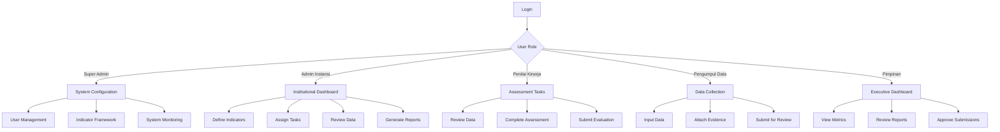

## 1. Product Overview

SAKIP (Sistem Akuntabilitas Kinerja Instansi Pemerintah) module implementation for structured performance accountability system in government agencies. This system enables comprehensive performance data collection, measurement, assessment, and reporting in accordance with Mahkamah Agung guidelines.

The module addresses the need for standardized performance accountability across government institutions, providing transparent and consistent evaluation mechanisms that support evidence-based decision making and public accountability.

## 2. Core Features

### 2.1 User Roles

| Role | Registration Method | Core Permissions |
|------|---------------------|------------------|
| Super Admin | System initialization | Full system access, user management, system configuration |
| Admin Instansi | Assigned by super admin | Manage institutional performance data, reports, assessments |
| Penilai Kinerja | Assigned by admin instansi | Conduct performance assessments, review indicators |
| Pengumpul Data | Assigned by admin instansi | Input and manage performance data, update indicators |
| Pimpinan | Assigned by admin instansi | View reports, approve assessments, strategic oversight |
| Auditor Eksternal | Special access | View audit trails, performance reports, compliance checks |

### 2.2 Feature Module

The SAKIP module consists of the following main pages:

1. **Dashboard SAKIP**: Performance overview, key indicators, alerts, quick actions
2. **Pengumpulan Data**: Data entry forms, bulk import, validation, documentation
3. **Pengukuran Kinerja**: Measurement tools, indicator tracking, scoring system
4. **Penilaian Kinerja**: Assessment workflows, evaluation forms, approval process
5. **Pelaporan**: Report generation, templates, export options, submission tracking
6. **Manajemen Indikator**: Indicator definition, targets, formulas, categorization
7. **Audit Trail**: Activity logs, change tracking, compliance monitoring
8. **Konfigurasi Sistem**: Settings, permissions, integration setup

### 2.3 Page Details

| Page Name | Module Name | Feature description |
|-----------|-------------|---------------------|
| Dashboard SAKIP | Performance Overview | Display real-time performance metrics, achievement percentages, trend charts, and compliance status indicators |
| Dashboard SAKIP | Alert System | Show overdue tasks, validation errors, pending approvals, and system notifications |
| Dashboard SAKIP | Quick Actions | Provide shortcuts to common tasks like data entry, report generation, and assessment initiation |
| Pengumpulan Data | Data Entry Forms | Create structured forms for collecting performance data with field validation and required documentation |
| Pengumpulan Data | Bulk Import | Upload data from spreadsheets with validation, error reporting, and rollback capabilities |
| Pengumpulan Data | Evidence Management | Attach supporting documents, images, and files with metadata and version control |
| Pengumpulan Data | Data Validation | Implement automatic validation rules, consistency checks, and approval workflows |
| Pengukuran Kinerja | Indicator Tracking | Monitor individual performance indicators with real-time calculations and progress visualization |
| Pengukuran Kinerja | Scoring System | Apply standardized scoring algorithms based on achievement levels and weights |
| Pengukuran Kinerja | Benchmark Comparison | Compare performance against targets, historical data, and peer institutions |
| Penilaian Kinerja | Assessment Workflow | Define multi-stage assessment processes with assigned evaluators and approval chains |
| Penilaian Kinerja | Evaluation Forms | Create customizable assessment forms with scoring rubrics and comment sections |
| Penilaian Kinerja | Approval Process | Implement hierarchical approval workflows with digital signatures and timestamps |
| Pelaporan | Report Templates | Provide standardized report formats compliant with SAKIP requirements |
| Pelaporan | Report Generation | Automatically compile data into comprehensive reports with charts and analysis |
| Pelaporan | Export Options | Support multiple formats (PDF, Excel, Word) with customizable layouts |
| Pelaporan | Submission Tracking | Monitor report submission status, deadlines, and approval progress |
| Manajemen Indikator | Indicator Definition | Create and manage performance indicators with clear definitions and measurement units |
| Manajemen Indikator | Target Setting | Set annual targets with breakdown by periods and responsible units |
| Manajemen Indikator | Formula Configuration | Define calculation formulas and aggregation methods for complex indicators |
| Audit Trail | Activity Logs | Record all user actions with timestamps, IP addresses, and change details |
| Audit Trail | Change Tracking | Maintain version history for all data modifications with before/after comparisons |
| Audit Trail | Compliance Monitoring | Track adherence to SAKIP procedures and identify potential violations |
| Konfigurasi Sistem | User Management | Create and manage user accounts with role-based permissions and access controls |
| Konfigurasi Sistem | Integration Setup | Configure connections with external systems and data sources |
| Konfigurasi Sistem | System Settings | Customize system parameters, notifications, and operational preferences |

## 3. Core Process

### Super Admin Flow
1. Login to system with super admin credentials
2. Configure institutional settings and user roles
3. Set up performance indicator frameworks
4. Monitor system-wide performance and compliance
5. Generate administrative reports

### Admin Instansi Flow
1. Access institutional dashboard
2. Define institutional performance indicators
3. Assign data collection tasks to staff
4. Review and validate collected data
5. Conduct performance assessments
6. Generate and submit institutional reports

### Penilai Kinerja Flow
1. Receive assessment assignments
2. Review performance data and evidence
3. Complete evaluation forms with scoring
4. Provide written assessments and recommendations
5. Submit evaluations for approval

### Pengumpul Data Flow
1. Receive data collection assignments
2. Input performance data through forms or bulk import
3. Attach supporting documentation and evidence
4. Submit data for validation and review
5. Respond to data correction requests

### Pimpinan Flow
1. Access executive dashboard with key metrics
2. Review performance reports and assessments
3. Approve final reports and submissions
4. Monitor institutional compliance status
5. Make strategic decisions based on performance data

## 4. User Interface Design

### 4.1 Design Style

- **Primary Colors**: Deep blue (#1e40af) for headers, green (#059669) for success indicators, orange (#d97706) for warnings
- **Secondary Colors**: Light gray (#f8fafc) for backgrounds, white for content areas
- **Button Style**: Rounded corners with subtle shadows, primary actions in blue, secondary in gray
- **Font**: Inter for headers, system-ui for body text, 14-16px base size
- **Layout**: Card-based design with clear visual hierarchy, responsive grid system
- **Icons**: Government-style icons using Heroicons, consistent stroke width
- **Data Visualization**: Clean charts with government color palette, accessible color combinations

### 4.2 Page Design Overview

| Page Name | Module Name | UI Elements |
|-----------|-------------|-------------|
| Dashboard SAKIP | Performance Overview | Full-width cards with KPI tiles, progress bars, trend arrows, interactive charts with hover details |
| Dashboard SAKIP | Alert System | Stacked notification cards with severity indicators, dismissible alerts, action buttons |
| Pengumpulan Data | Data Entry Forms | Multi-step forms with progress indicators, required field markers, inline validation messages |
| Pengumpulan Data | Bulk Import | Drag-and-drop file upload area, preview table, error highlighting, success confirmation |
| Pengukuran Kinerja | Indicator Tracking | Data table with sortable columns, inline editing, status badges, filter controls |
| Penilaian Kinerja | Assessment Forms | Tabbed interface for different assessment sections, rich text editor for comments, scoring sliders |
| Pelaporan | Report Templates | Template gallery with thumbnails, customization options, preview pane, export format selection |
| Audit Trail | Activity Logs | Timeline view with user avatars, search and filter controls, export functionality |

### 4.3 Responsiveness

- **Desktop-First**: Optimized for 1920x1080 and 1366x768 resolutions
- **Mobile Adaptive**: Responsive breakpoints at 768px and 480px
- **Touch Optimization**: Larger touch targets for mobile devices, swipe gestures for navigation
- **Print Optimization**: Special stylesheets for report printing with proper page breaks
- **Accessibility**: WCAG 2.1 AA compliance, keyboard navigation, screen reader support

## 5. Additional Requirements

### 5.1 Data Security
- End-to-end encryption for sensitive performance data
- Role-based access control with granular permissions
- Audit logging for all data access and modifications
- Regular security assessments and penetration testing

### 5.2 Performance Requirements
- Page load time under 3 seconds for standard operations
- Support for 1000+ concurrent users
- Real-time data synchronization across modules
- Efficient data processing for large datasets (100k+ records)

### 5.3 Integration Requirements
- RESTful API for external system integration
- Support for SSO (Single Sign-On) authentication
- Data export in multiple formats (XML, JSON, CSV)
- Webhook support for real-time notifications

### 5.4 Compliance Requirements
- Adherence to Indonesian government data protection regulations
- Compliance with SK Sekretaris Mahkamah Agung Nomor 2049 Tahun 2022
- Support for e-government interoperability standards
- Regular compliance reporting and monitoring