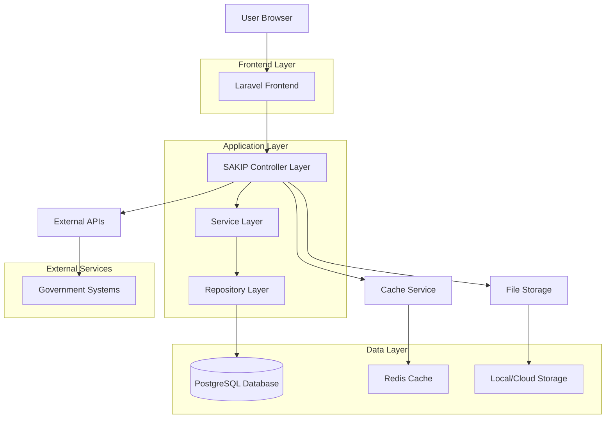
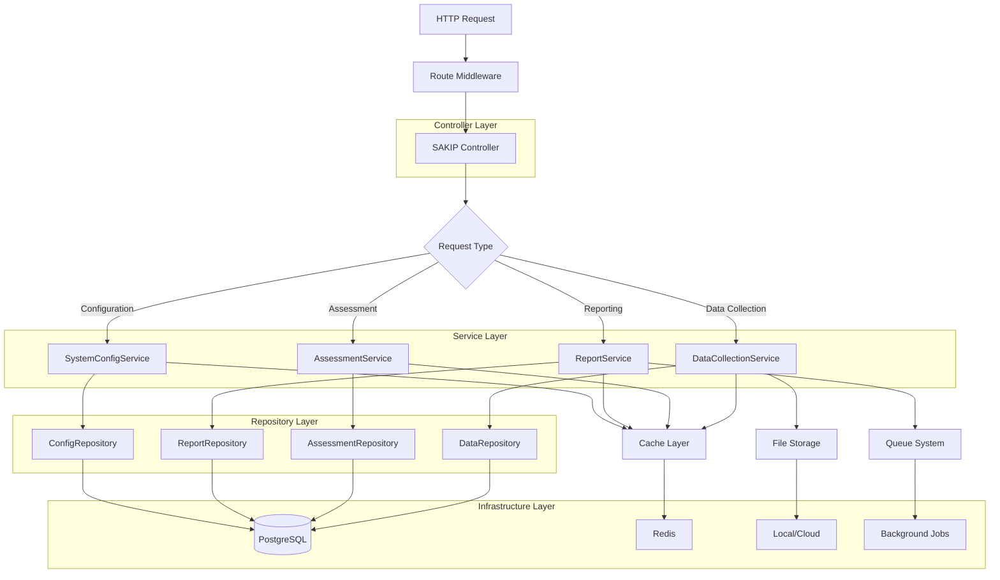
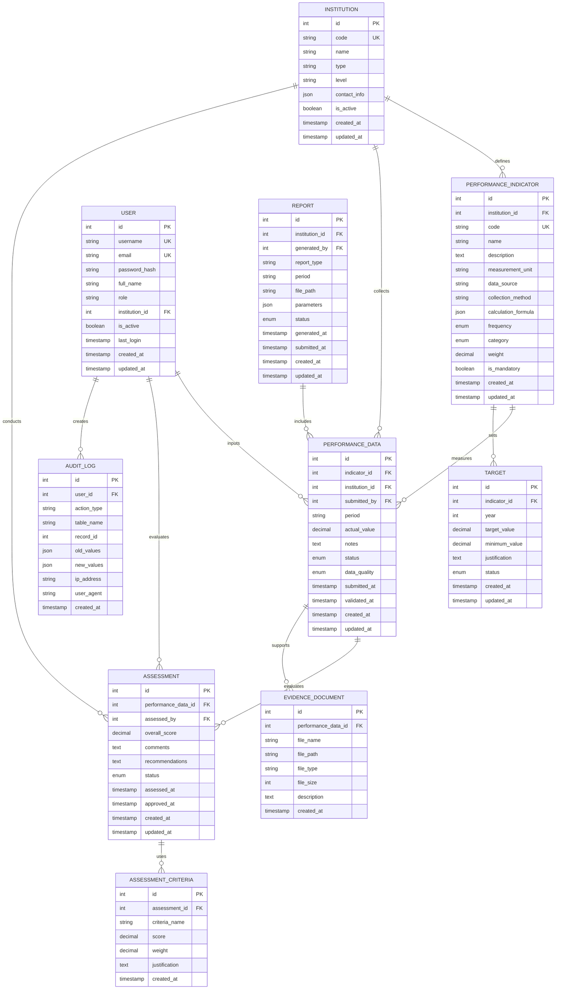

## 1. Architecture Design



## 2. Technology Description

- **Backend**: Laravel 11.x with PHP 8.2+
- **Frontend**: Blade templating with Livewire components
- **Database**: PostgreSQL 14+ with JSON support
- **Cache**: Redis for session and data caching
- **Queue**: Laravel Queue for background processing
- **File Storage**: Local storage with cloud backup options
- **API**: RESTful with JSON responses
- **Authentication**: Laravel Sanctum for API, Session for web
- **Testing**: PHPUnit for backend, Laravel Dusk for frontend

## 3. Route Definitions

| Route | Purpose | Middleware |
|-------|---------|------------|
| /sakip/dashboard | Main SAKIP dashboard | auth, role:admin\|pimpinan |
| /sakip/data-collection | Data collection interface | auth, role:pengumpul-data\|admin |
| /sakip/data-collection/create | Create new data entry | auth, role:pengumpul-data |
| /sakip/data-collection/{id}/edit | Edit existing data | auth, role:pengumpul-data |
| /sakip/measurement | Performance measurement | auth, role:penilai\|admin |
| /sakip/assessment | Performance assessment | auth, role:penilai\|admin |
| /sakip/assessment/{id}/evaluate | Detailed evaluation form | auth, role:penilai |
| /sakip/reports | Report generation | auth, role:admin\|pimpinan |
| /sakip/reports/generate | Generate reports | auth, role:admin |
| /sakip/indicators | Indicator management | auth, role:admin |
| /sakip/audit-logs | Audit trail viewing | auth, role:super-admin\|auditor |
| /sakip/settings | System configuration | auth, role:super-admin |
| /api/sakip/data | API for data operations | auth:sanctum |
| /api/sakip/reports | API for report data | auth:sanctum |

## 4. API Definitions

### 4.1 Core API Endpoints

#### Performance Data Management
```
POST /api/sakip/data/collect
```

Request:
| Param Name | Param Type | isRequired | Description |
|------------|-------------|-------------|-------------|
| indicator_id | integer | true | Performance indicator ID |
| period | string | true | Reporting period (YYYY-MM) |
| value | numeric | true | Measured value |
| evidence | file | false | Supporting document |
| notes | string | false | Additional notes |

Response:
| Param Name | Param Type | Description |
|------------|-------------|-------------|
| success | boolean | Operation status |
| data | object | Created data record |
| message | string | Status message |

#### Performance Assessment
```
POST /api/sakip/assessment/evaluate
```

Request:
| Param Name | Param Type | isRequired | Description |
|------------|-------------|-------------|-------------|
| data_id | integer | true | Data record ID |
| score | numeric | true | Assessment score (0-100) |
| criteria | array | true | Assessment criteria scores |
| comments | string | false | Evaluator comments |
| recommendation | string | false | Improvement recommendations |

#### Report Generation
```
POST /api/sakip/reports/generate
```

Request:
| Param Name | Param Type | isRequired | Description |
|------------|-------------|-------------|-------------|
| report_type | string | true | Report type (monthly, quarterly, annual) |
| period | string | true | Reporting period |
| format | string | true | Output format (pdf, excel, word) |
| institution_id | integer | false | Specific institution filter |

## 5. Server Architecture Diagram



## 6. Data Model

### 6.1 Entity Relationship Diagram



### 6.2 Data Definition Language

#### Performance Indicators Table
```sql
CREATE TABLE performance_indicators (
    id SERIAL PRIMARY KEY,
    institution_id INTEGER NOT NULL REFERENCES institutions(id),
    code VARCHAR(50) NOT NULL UNIQUE,
    name VARCHAR(255) NOT NULL,
    description TEXT,
    measurement_unit VARCHAR(100) NOT NULL,
    data_source VARCHAR(255),
    collection_method VARCHAR(100),
    calculation_formula JSONB,
    frequency VARCHAR(20) CHECK (frequency IN ('monthly', 'quarterly', 'semester', 'annual')),
    category VARCHAR(50) CHECK (category IN ('input', 'output', 'outcome', 'impact')),
    weight DECIMAL(5,2) DEFAULT 1.0,
    is_mandatory BOOLEAN DEFAULT false,
    created_at TIMESTAMP DEFAULT CURRENT_TIMESTAMP,
    updated_at TIMESTAMP DEFAULT CURRENT_TIMESTAMP
);

CREATE INDEX idx_performance_indicators_institution ON performance_indicators(institution_id);
CREATE INDEX idx_performance_indicators_category ON performance_indicators(category);
CREATE INDEX idx_performance_indicators_frequency ON performance_indicators(frequency);
```

#### Performance Data Table
```sql
CREATE TABLE performance_data (
    id SERIAL PRIMARY KEY,
    indicator_id INTEGER NOT NULL REFERENCES performance_indicators(id),
    institution_id INTEGER NOT NULL REFERENCES institutions(id),
    submitted_by INTEGER NOT NULL REFERENCES users(id),
    period VARCHAR(7) NOT NULL, -- YYYY-MM format
    actual_value DECIMAL(15,2),
    notes TEXT,
    status VARCHAR(20) DEFAULT 'draft' CHECK (status IN ('draft', 'submitted', 'validated', 'rejected')),
    data_quality VARCHAR(20) DEFAULT 'good' CHECK (data_quality IN ('excellent', 'good', 'fair', 'poor')),
    submitted_at TIMESTAMP,
    validated_at TIMESTAMP,
    created_at TIMESTAMP DEFAULT CURRENT_TIMESTAMP,
    updated_at TIMESTAMP DEFAULT CURRENT_TIMESTAMP,
    UNIQUE(indicator_id, institution_id, period)
);

CREATE INDEX idx_performance_data_indicator ON performance_data(indicator_id);
CREATE INDEX idx_performance_data_institution ON performance_data(institution_id);
CREATE INDEX idx_performance_data_period ON performance_data(period);
CREATE INDEX idx_performance_data_status ON performance_data(status);
```

#### Assessment Table
```sql
CREATE TABLE assessments (
    id SERIAL PRIMARY KEY,
    performance_data_id INTEGER NOT NULL UNIQUE REFERENCES performance_data(id),
    assessed_by INTEGER NOT NULL REFERENCES users(id),
    overall_score DECIMAL(5,2) CHECK (overall_score >= 0 AND overall_score <= 100),
    comments TEXT,
    recommendations TEXT,
    status VARCHAR(20) DEFAULT 'pending' CHECK (status IN ('pending', 'in_review', 'completed', 'approved')),
    assessed_at TIMESTAMP,
    approved_at TIMESTAMP,
    created_at TIMESTAMP DEFAULT CURRENT_TIMESTAMP,
    updated_at TIMESTAMP DEFAULT CURRENT_TIMESTAMP
);

CREATE INDEX idx_assessments_performance_data ON assessments(performance_data_id);
CREATE INDEX idx_assessments_assessed_by ON assessments(assessed_by);
CREATE INDEX idx_assessments_status ON assessments(status);
```

#### Evidence Documents Table
```sql
CREATE TABLE evidence_documents (
    id SERIAL PRIMARY KEY,
    performance_data_id INTEGER NOT NULL REFERENCES performance_data(id),
    file_name VARCHAR(255) NOT NULL,
    file_path VARCHAR(500) NOT NULL,
    file_type VARCHAR(100),
    file_size INTEGER,
    description TEXT,
    created_at TIMESTAMP DEFAULT CURRENT_TIMESTAMP
);

CREATE INDEX idx_evidence_documents_performance_data ON evidence_documents(performance_data_id);
```

#### Audit Logs Table
```sql
CREATE TABLE audit_logs (
    id SERIAL PRIMARY KEY,
    user_id INTEGER NOT NULL REFERENCES users(id),
    action_type VARCHAR(50) NOT NULL,
    table_name VARCHAR(100) NOT NULL,
    record_id INTEGER,
    old_values JSONB,
    new_values JSONB,
    ip_address INET,
    user_agent TEXT,
    created_at TIMESTAMP DEFAULT CURRENT_TIMESTAMP
);

CREATE INDEX idx_audit_logs_user ON audit_logs(user_id);
CREATE INDEX idx_audit_logs_action ON audit_logs(action_type);
CREATE INDEX idx_audit_logs_table ON audit_logs(table_name);
CREATE INDEX idx_audit_logs_created ON audit_logs(created_at);
```

## 7. Service Layer Architecture

### 7.1 Core Services

#### DataCollectionService
- **Purpose**: Handle performance data collection and validation
- **Key Methods**:
  - `collectData(array $data): PerformanceData`
  - `validateData(PerformanceData $data): ValidationResult`
  - `bulkImport(array $records): ImportResult`
  - `attachEvidence(int $dataId, UploadedFile $file): EvidenceDocument`

#### AssessmentService
- **Purpose**: Manage performance assessment workflows
- **Key Methods**:
  - `createAssessment(int $dataId, array $criteria): Assessment`
  - `calculateScore(array $criteria): decimal`
  - `approveAssessment(int $assessmentId): bool`
  - `generateRecommendations(PerformanceData $data): array`

#### ReportService
- **Purpose**: Generate various types of performance reports
- **Key Methods**:
  - `generateReport(string $type, string $period, array $parameters): Report`
  - `exportReport(int $reportId, string $format): File`
  - `compileInstitutionalReport(int $institutionId, string $period): array`
  - `calculateAchievementPercentage(array $data): decimal`

#### AuditService
- **Purpose**: Track all system activities for compliance
- **Key Methods**:
  - `logActivity(string $action, Model $model, array $changes): void`
  - `getAuditTrail(string $table, int $recordId): Collection`
  - `generateComplianceReport(string $period): array`
  - `detectAnomalies(array $criteria): array`

## 8. Security Implementation

### 8.1 Authentication & Authorization
- Multi-factor authentication for sensitive operations
- Role-based access control (RBAC) with permissions matrix
- Session management with secure token generation
- API rate limiting and throttling

### 8.2 Data Protection
- Encryption at rest for sensitive performance data
- Secure file upload with virus scanning
- Data anonymization for external sharing
- Regular security audits and penetration testing

### 8.3 Audit & Compliance
- Comprehensive audit logging for all operations
- Immutable audit trail with blockchain integration option
- Compliance reporting against SAKIP standards
- Data retention policies and archival procedures

## 9. Performance Optimization

### 9.1 Caching Strategy
- Redis caching for frequently accessed indicators
- Query result caching with intelligent invalidation
- Report caching with configurable TTL
- CDN integration for static assets

### 9.2 Database Optimization
- Indexed columns for common query patterns
- Partitioned tables for large datasets
- Query optimization with EXPLAIN analysis
- Connection pooling and read replicas

### 9.3 Background Processing
- Laravel Queue for report generation
- Scheduled tasks for data aggregation
- Batch processing for bulk operations
- Real-time notifications via WebSockets

## 10. Integration Specifications

### 10.1 External System Integration
- RESTful API with JSON responses
- OAuth 2.0 for secure API access
- Webhook support for real-time updates
- SOAP compatibility for legacy systems

### 10.2 Data Exchange Formats
- Standardized JSON schemas for data exchange
- XML support for government legacy systems
- CSV import/export with validation
- PDF generation with digital signatures

### 10.3 Government System Compatibility
- Integration with e-government platforms
- Compliance with Indonesian data standards
- Support for SPBE (Sistem Pemerintahan Berbasis Elektronik)
- Interoperability with existing SAKIP systems