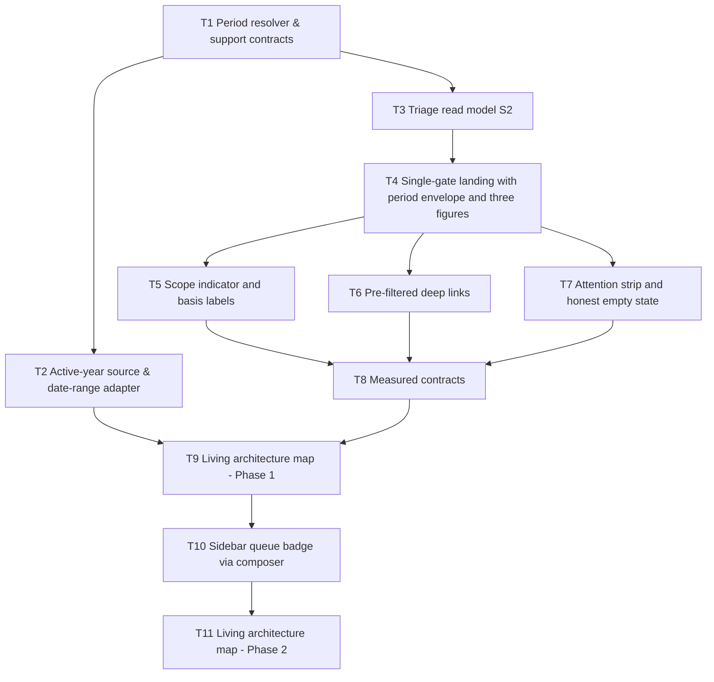

<!-- markdownlint-disable -->

# Implementation Plan: Admin Triage Landing (Landing Triage)

> **Naming deviation (documented):** this file keeps the path `plan/plan-admin-triage-landing.md` declared by the Spec's `target_plan` front-matter key, instead of the skill's
> `plan-[purpose]-[component]-[version].md` pattern, so the PRD ↔ Spec ↔ Plan traceability audit can resolve the link. The version lives in the front matter above.
>
> **Execution honesty:** this workspace has no PHP toolchain (`php: command not found`). Every PHP command below is therefore executed when a toolchain exists and reported **unverified** otherwise — never
> claimed green (Spec §7.4, AC-035, `CONSTRAINTS.md` §2).

## 1. Architectural Strategy & Task Graph

**Strategy.** Work bottom-up through the Spec's four pre-agreed seams, and slice the HTTP work by *user capability* rather than by layer:

1. **Foundations first (S1, then the REQ-014 adapter).** A pure value object plus one config key; no DB, no HTTP, no auth — the cheapest possible RED and the single source of the period vocabulary.
2. **Read model second (S2).** One service, one canonical fixture matrix, three counts in their only allowed forms. Everything downstream consumes this contract unchanged.
3. **Landing slices (S3).** Each ticket adds one user-observable capability to the same route: *"I can reach the page and see figures for a period"* → *"…and I know whose data it is and what period each figure claims"* → *"…and one click takes me to the queue"* → *"…and an empty period explains itself"* → *"…and the page stays within its measured contract"*.
4. **Badge last (S4, Phase 2).** It reuses the S1/S2 contracts unchanged, so it can only start once Phase 1 is green.
5. **Expand–contract for the one refactor (T2).** `SakipDashboardService::getDateRange()` is `protected`, has five internal call sites and **no direct test today** — so T2 leaves the method signature and its five call sites untouched, and changes only the body.

## 2. Requirements & Constraints

| Contract | What the plan must honour | Ticket |
| --- | --- | --- |
| REQ-001, REQ-002, REQ-003 | One period vocabulary of exactly five keys; any unknown/empty/non-string/array `period` resolves to `current_year` without throwing; the rendered period is reproducible from the URL | T1, T4 |
| REQ-004, REQ-005 | Exactly one always-visible scope indicator; exactly three figures in the order Verifikasi → Asesmen → Laporan, each with its own basis label | T5 |
| REQ-006, REQ-007, REQ-008 | Verification is period-scoped by a `YYYY-MM` range; assessment and report are **not** period-scoped and are labelled `Tidak dibatasi periode`; the assessment population excludes soft-deleted parents | T3, T5 |
| REQ-009 | Every figure is one anchor built with `route()` carrying only parameters its target honours — never string concatenation | T6 |
| REQ-010 | One signal per non-empty queue with exactly one action; the strip is absent and an empty-period sentence takes its place when all three counts are zero | T7 |
| REQ-011 | Login telemetry never occupies a figure slot; the triage block renders exactly three figures | T5 |
| REQ-012 | The sidebar badge is produced by a `layouts.modern` view composer, on every page using that layout, and shares one count implementation with the landing | T10 |
| REQ-013 | Exactly one authorization gate: the route middleware `can:admin.dashboard`; the controller's phantom `can:access-admin-dashboard` middleware is deleted | T4 |
| REQ-014 | One active-year source: `ForYearTrait` delegates to `ReportingPeriod::activeYear()`, the dead `ForYearScope.php` is deleted, and `getDateRange()` becomes an adapter over the same resolver | T2 |
| REQ-015 | The active year comes from `config('sakip.reporting.active_year')` (new key inside the existing `reporting` block), default `null` = use the clock, cast with `(int)` at its single read site | T1 |
| SEC-001, SEC-002 | No `withoutGlobalScope`/`withoutInstansiScope`/manual tenancy; agency coverage is applied explicitly by the read model so it holds even with no authenticated user | T3, T8 |
| SEC-003, SEC-004 | The untrusted `period` parameter is whitelisted before any use; no new permission, role, gate or policy is introduced | T4 |
| CON-001, CON-002 | PHP ^8.3 + Laravel 12 + Blade/Bootstrap; no new dependency; no migration and no schema change (the feature is read-only) | all |
| CON-003 | ≤ 6 domain statements per render; expected exact counts 4 (cross-agency) / 5 (agency-bound) / 1 (unassigned) in Phase 1, rising to 5 / 6 / 2 after T10 | T8, T10 |
| CON-004 | The period selector is a plain `<form method="GET">` with an explicit submit control and **no** inline event handler | T4 |
| CON-005, CON-007 | Only the frozen Indonesian copy from Spec §4.4; assertions use `$content = $response->getContent()` with `assertStringContainsString` / `assertStringNotContainsString` only | T4, T5, T6, T7 |
| CON-006 | Every Blade `route()` name exists (`ArchitectureGuardTest` walks `resources/views`) and new short class names stay unique in `app/` | T4–T10 |
| CON-008 | Floor-guard: no suppressions, no skipped/incomplete tests, no weakened assertions, no lowered thresholds, no `phpunit.xml`/CI edits | every VERIFY step |

## 3. Risks & Assumptions (Extracted from Spec)

Every item below is an upstream `[ASSUMPTION]` tag or a documented residual. Tasks touching the first five are **High Risk**, and their tests restate the reasoning in a comment.

| # | Assumption / risk | Risk | Where it is pinned |
| --- | --- | --- | --- |
| ASSUMPTION-001 | **A2** — the triage row carries exactly three figures, the two inventory cards are removed, and `Indikator Kinerja` in `layouts/modern` is deliberately **not** asserted (region-scoped negative assertion only) | High | T5 (TC-049, TC-050) |
| ASSUMPTION-002 | **A8** — an assessment whose parent `PerformanceData` is soft-deleted is **not** pending work; both count forms use `whereHas('performanceData')` | High | T3 (TC-020, TC-021) |
| ASSUMPTION-003 | **A9 / D-S7** — the assessment figure stays period-independent although its target is year-bounded; the divergence is accepted **and asserted**, with its assertion scope limited to the §5.0 matrix | High | T8 (TC-054) |
| ASSUMPTION-004 | **A9 / D-S8** — the cross-agency verification figure renders while its target queue is empty; accepted, documented and asserted as reachability | High | T8 (TC-055) |
| ASSUMPTION-005 | **A7** — the scope label tolerates a soft-deleted agency (`withTrashed()` label-only carve-out, never inside a count) and falls back to `Unassigned` when the name cannot resolve | Medium | T3 (TC-023, TC-024) |
| ASSUMPTION-006 | **A3** — new namespaces `App\Support\…` and (Phase 2) `App\View\Composers\…`; both must be recorded in `docs/ARCHITECTURE.md` in the same change | Low | T1, T9, T11 |
| ASSUMPTION-007 | **A5 / A6 / D-S5** — the badge resolves its period from the request, renders no zero badge, and only on `layouts.modern` | Medium | T10 (TC-057…TC-059) |
| ASSUMPTION-008 | **A4** — the assessment deep link carries `status=pending` only and never a `period` parameter | Low | T6 (TC-039) |
| RISK-001 | **No direct test exists for `SakipDashboardService`**, and `getDateRange()` is `protected` with five internal call sites — the REQ-014 adapter is the least-protected change in the slice | High | T2: expand–contract (change the body only), a dedicated adapter test through an anonymous subclass, plus a `sakip.dashboard` route smoke check |
| RISK-002 | Deleting the controller middleware widens who reaches the page; a broadened gate would be a security regression, not a convenience | High | T4: TC-035 asserts `200` **for the permitted viewer only**; TC-036 asserts `403` for everyone else |
| RISK-003 | `tests/Unit` carries a `< 10 s` target / `< 20 s` hard runtime floor and S2 adds the second DB-backed unit class there | Medium | T3 VERIFY measures the Unit runtime; the Phase-1 gate re-measures |
| RISK-004 | No PHP toolchain in this workspace, so gates cannot be executed here | High (process) | every VERIFY step reports **unverified**; never claimed green |
| NOTE-001 | Checklist gap: `TriageScope::defaultLabel()` has no direct unit case; it is covered only indirectly by TC-018/TC-034. Recorded here, not silently patched | Low | T5 review note; optional addendum case |
| NOTE-002 | The working tree was clean when this plan was written (baseline commit `9c3eaee`); any dirt appearing mid-plan must never be staged with a feature commit | Medium (process) | every COMMIT step stages explicit paths only |

---

## 4. Tracer-Bullet Implementation Slices

Every ticket is a vertical slice with its own **RED → GREEN → VERIFY → COMMIT** cycle and **exactly one commit**. Verification commands are fixed: the focused filter first, then
`./vendor/bin/pint --test --no-interaction`, then the full suite (`php artisan test`). Where no PHP toolchain exists, the step is recorded as **unverified** — never as passed.

### Phase 1: MVP Vertical Slice (seams S1 → S2 → S3)

#### Ticket-001: Period vocabulary resolver (S1 seam)

- **Target Seam:** `App\Support\ReportingPeriod` — with its two support contracts `App\Support\TriageScope` and `App\Support\AdminTriageSummary`
- **Upstream Ref:** Spec §4.1, §7.2 | REQ-001, REQ-002, REQ-015 | Checklist TC-001…TC-012
- **File Impact:** `app/Support/ReportingPeriod.php` (new), `app/Support/TriageScope.php` (new), `app/Support/AdminTriageSummary.php` (new), `config/sakip.php` (new `active_year` key inside the existing `reporting` block), `tests/Unit/Support/ReportingPeriodTest.php` (new) — Size **M**
- [ ] **Step 1 (RED):** write TC-001…TC-012 in `tests/Unit/Support/ReportingPeriodTest.php` — year bounds/label, the five hostile keys (`null`, `''`, `'not-a-key'`, `'2026'`, `'CURRENT_YEAR'`), the four quarter/month windows with Indonesian labels, the flag exclusivity, the `performancePeriodRange()` ordering, the day bounds, the config string→int cast, both precedence directions (AC-039), and the single-month deep-link derivation. Run `php artisan test --filter=ReportingPeriodTest` and confirm every case fails because the class does not exist.
- [ ] **Step 2 (GREEN):** implement `ReportingPeriod` as a `final readonly` value object with an injectable `CarbonImmutable $now`; read the config once and cast with `(int)`; implement `TriageScope::defaultLabel()` with the two canonical strings; implement `AdminTriageSummary` with `PERIOD_INDEPENDENT_BASIS_LABEL`; add the `active_year` key (default `null`).
- [ ] **Step 3 (VERIFY):** `php artisan test --filter=ReportingPeriodTest` → green; `./vendor/bin/pint --test --no-interaction`; full suite; note the `php artisan test --testsuite=Unit` runtime as the pre-S2 baseline.
- [ ] **Step 4 (COMMIT):** `feat(triage): add the reporting-period resolver and its support contracts`

#### Ticket-002: One active-year source for every year-scoped query

- **Target Seam:** `ForYearTrait::scopeForCurrentYear()` plus `SakipDashboardService::getDateRange()` (expand–contract: body only)
- **Upstream Ref:** Spec §3.3, §7.2 | REQ-014 | Checklist TC-013, TC-068, TC-069 | RISK-001
- **File Impact:** `app/Models/Scopes/ForYearTrait.php`, `app/Models/Scopes/ForYearScope.php` (delete), `app/Services/SakipDashboardService.php`, `tests/Unit/Scopes/ForYearTraitTest.php` (new), `tests/Unit/Services/DashboardDateRangeAdapterTest.php` (new) — Size **M**
- [ ] **Step 1 (RED):** TC-013 asserts the scope filters by the **configured** active year; TC-068 asserts the adapter still returns a mutable `Carbon` pair with `00:00:00`/`23:59:59` bounds for all five keys (invoke the `protected` method through an anonymous subclass — do **not** change its visibility); TC-069 asserts no file references the deleted `ForYearScope`/`ForYear`. Run the two filters and confirm failure.
- [ ] **Step 2 (GREEN):** delegate `scopeForCurrentYear` to `ReportingPeriod::activeYear()`, make `getDateRange()` resolve through `ReportingPeriod` while preserving `array{0: Carbon, 1: Carbon}`, and delete `app/Models/Scopes/ForYearScope.php`. Leave all five call sites (`:67, :87, :256, :392, :444`) untouched.
- [ ] **Step 3 (VERIFY):** both filters green; **route smoke** `php artisan test --filter=SakipDashboardAccessTest` (the closest existing coverage to this service); full suite; pint.
- [ ] **Step 4 (COMMIT):** `refactor(period): route every year scope through the active-year resolver`

#### Ticket-003: Instansi-scoped triage read model (S2 seam)

- **Target Seam:** `App\Services\AdminTriageService::summaryFor()` / `verificationCountFor()`
- **Upstream Ref:** Spec §4.2, §6.2 | SEC-002 | AC-009…AC-012, AC-025, AC-036 | Checklist TC-014…TC-027 | ASSUMPTION-002, ASSUMPTION-005
- **File Impact:** `app/Services/AdminTriageService.php` (new), `tests/Unit/Services/AdminTriageServiceTest.php` (new) — Size **S**
- [ ] **Step 1 (RED):** write the S2 cases **in this order**: TC-014 (the §5.0 fixture matrix builder — the precondition), TC-015/TC-016/TC-017/TC-018 (the three viewer states and the invariants), TC-023/TC-024 (agency-label edge cases), TC-019 (single count implementation), TC-020/TC-021 (canonical population), TC-022 (period invariance), TC-025/TC-026 (URL and label contracts), TC-027 (read-only). **No `actingAs()`** anywhere in this file. Run `php artisan test --filter=AdminTriageServiceTest` and confirm failure on the missing service.
- [ ] **Step 2 (GREEN):** implement the three scope states in the fixed order (Super Admin → agency-bound → unassigned short-circuit with **no** count query), the three counts in their only allowed forms — `PerformanceData::…->whereBetween('period', $range)->submitted()` with the explicit `instansi_id`, `Assessment::…->pending()->whereHas('performanceData', …)`, `Report::…->submitted()` — plus `route()` deep-link URLs and a `verificationCountFor()` that delegates to the same builder.
- [ ] **Step 3 (VERIFY):** focused test green; pint; full suite; record the `Unit` suite runtime against the `< 10 s` / `< 20 s` floor (RISK-003).
- [ ] **Step 4 (COMMIT):** `feat(triage): add the instansi-scoped triage read model`

#### Ticket-004: Single-gate landing with its period envelope

- **Target Seam:** `GET /admin/dashboard` (`admin.dashboard`)
- **Upstream Ref:** Spec §4.3, §4.4, §4.5 | REQ-002, REQ-013 | AC-005…AC-008, AC-015…AC-017, AC-029 | Checklist TC-028…TC-032, TC-035…TC-037, TC-042, TC-043, TC-051 | RISK-002
- **File Impact:** `app/Http/Controllers/Admin/AdminDashboardController.php`, `resources/views/admin/dashboard.blade.php`, `tests/Feature/AdminTriageLandingTest.php` (new) — Size **M**
- [ ] **Step 1 (RED):** write TC-035 first — a verified, non-`Super Admin` holder of `admin.dashboard` must receive `200`; it **fails today** with `403` because of the controller middleware (finding C1). Then TC-036 (`403` for everyone else, with no triage copy leaked), TC-037 (no redirect), TC-028…TC-032 (default render, invalid value, array input, hostile value, reproducibility), TC-042 (region + handles once), TC-043 (one name per anchor), TC-051 (GET form, no inline handler). Run `php artisan test --filter=AdminTriageLandingTest` and record which cases fail and why.
- [ ] **Step 2 (GREEN):** delete `$this->middleware('can:access-admin-dashboard')`; keep the controller thin (read the scalar `period`, delegate to `ReportingPeriod::fromKey()`, call the service, bind the view); render one `<section data-triage-region data-triage-period data-triage-scope>` holding the scope indicator, a `<form method="GET">` period selector with an explicit submit control, and the three `data-triage-figure` anchors with their real counts. Keep the recent-activity table and the quick actions at the bottom.
- [ ] **Step 3 (VERIFY):** focused feature test green; pint; full suite incl. `SakipDashboardAccessTest`; confirm the seeded-permission helper style matches `ReportIndexRendersTest:19-27`.
- [ ] **Step 4 (COMMIT):** `feat(triage): make the admin landing a gated triage page with a period envelope`

#### Ticket-005: Explicit agency scope with per-figure basis labels

- **Target Seam:** the rendered triage region (S3)
- **Upstream Ref:** Spec §4.4 | REQ-004, REQ-005, REQ-011 | AC-013, AC-014, AC-027, AC-033 | Checklist TC-033, TC-034, TC-044, TC-049, TC-050 | ASSUMPTION-001
- **File Impact:** `resources/views/admin/dashboard.blade.php`, `tests/Feature/AdminTriageLandingTest.php` — Size **S**
- [ ] **Step 1 (RED):** TC-033 (`data-triage-scope="agency"` with the agency name, versus `cross_agency` + `Semua Instansi`), TC-034 (unassigned viewer → handle, canonical label, three zeros, and `Semua Instansi` appearing **nowhere** in the response), TC-044 (the assessment and report anchors never carry the selected period label), TC-049 (the region-scoped negative assertion: `Aktivitas Login (7 Hari)` and `Tervalidasi` absent from the extracted `<section data-triage-region>`), TC-050 (the do-no-harm guard: the layout shell's own copy is **not** touched). Run the filter; the negative assertions must fail for the right reason (the strings still render).
- [ ] **Step 2 (GREEN):** render the scope indicator with the three canonical states, put `Tidak dibatasi periode` on figures 2 and 3, remove the telemetry card and the two inventory cards from the triage block, and leave `resources/views/layouts/modern.blade.php` untouched.
- [ ] **Step 3 (VERIFY):** focused filter green; pint; full suite; re-read the extracted region by hand to confirm `Indikator Kinerja` is legitimately still present **outside** it (that is the documented carve-out).
- [ ] **Step 4 (COMMIT):** `feat(triage): state the agency scope and every figure basis label`

#### Ticket-006: Pre-filtered deep links from every figure

- **Target Seam:** the three figure anchors (S3)
- **Upstream Ref:** Spec §4.3 | REQ-009 | AC-018…AC-022 | Checklist TC-038…TC-041, TC-056 | ASSUMPTION-008
- [ ] **Step 1 (RED):** TC-038 (`period=YYYY-MM` on the verification anchor **only** for a single-month selection), TC-039 and TC-040 (assessment and report anchors always carry their status and **never** `period`), TC-041 (each `href` with the query stripped resolves to a reachable page), TC-056 (no forbidden `instansi=` parameter anywhere). Run the filter and confirm failure.
- [ ] **Step 2 (GREEN):** build every `href` with `route()` and the §4.3 parameter rules — `validation_status=submitted` (+ `period` only when `isSingleMonth()`), `status=pending`, `status=submitted` — with no string concatenation and no parameter a target does not honour.
- [ ] **Step 3 (VERIFY):** focused filter green; pint; full suite; confirm `ArchitectureGuardTest::every_blade_route_name_exists` still passes with the three route names.
- [ ] **Step 4 (COMMIT):** `feat(triage): deep-link every figure into its queue`

#### Ticket-007: Attention strip for non-empty queues

- **Target Seam:** the attention strip and empty-period sentence (S3)
- **Upstream Ref:** Spec §4.4 | REQ-010 | AC-030, AC-031, AC-032 | Checklist TC-046, TC-047, TC-048
- **File Impact:** `resources/views/admin/dashboard.blade.php`, `tests/Feature/AdminTriageLandingTest.php` — Size **S**
- [ ] **Step 1 (RED):** TC-046 (all three counts zero → `data-triage-attention` absent, `data-triage-empty` present with `Belum ada pekerjaan tertunda pada periode ini.`), TC-047 (work in exactly one queue → exactly one `data-triage-signal` whose handle matches that queue, with exactly one action each), TC-048 (switching between an empty and a non-empty period shows and hides the strip with no carry-over). Run the filter and confirm failure.
- [ ] **Step 2 (GREEN):** render one signal per non-empty queue with its frozen action label, and the empty sentence when every count is zero - never both, and never a signal for a zero queue.
- [ ] **Step 3 (VERIFY):** focused filter green; pint; full suite.
- [ ] **Step 4 (COMMIT):** `feat(triage): explain the queues with a signal strip and an empty-period sentence`

#### Ticket-008: Measured contracts for the landing

- **Target Seam:** the measured behaviour of `GET /admin/dashboard`
- **Upstream Ref:** Spec §4.4, §6.2 | CON-003, SEC-002 | AC-034, AC-037, AC-038 | Checklist TC-052, TC-053, TC-054, TC-055 | ASSUMPTION-003, ASSUMPTION-004
- **File Impact:** `tests/Feature/AdminTriageLandingTest.php` (plus `app/Http/Controllers/Admin/AdminDashboardController.php` only if a statement must be removed to meet the budget) — Size **S**
- [ ] **Step 1 (RED):** TC-052 (domain-query count == 4 for the cross-agency viewer and 5 for the agency-bound viewer, ≤ 6 ceiling, asserted exactly per state), TC-053 (a `Super Admin` render equals an unauthenticated `summaryFor()` call - the ambient-auth invariant moved here by C-2), TC-054 (figure↔target agreement for the agency-bound viewer, scoped to the §5.0 matrix), TC-055 (the cross-agency verification link is rendered and reachable although its queue is empty). Run the filter; TC-052 and TC-054 must fail until measured.
- [ ] **Step 2 (GREEN):** no new feature code is expected. Fix only what the measurements reveal (for example a duplicated recent-activity query), and add the accepted-divergence comment referencing D-S7/D-S8 so the divergence is documented where it is asserted.
- [ ] **Step 3 (VERIFY):** focused filter green; pint; full suite of 12 feature files; confirm the counted statements match §4.4 for the third viewer state (unassigned == 1).
- [ ] **Step 4 (COMMIT):** `test(triage): pin the query budget and the accepted figure-target divergences`

#### Ticket-009: Living architecture map (Phase 1 record)

- **Target Seam:** `docs/ARCHITECTURE.md` (documentation slice)
- **Upstream Ref:** Spec §9.4 obligation 1 | AGENTS.md Living Architecture Map Mandate | Checklist TC-060 | ASSUMPTION-006
- **File Impact:** `docs/ARCHITECTURE.md` — Size **XS**
- [ ] **Step 1 (RED - evidence of the gap):** `grep -n 'app/Support' docs/ARCHITECTURE.md` returns nothing, and `grep -n 'app/Services' docs/ARCHITECTURE.md` shows the existing convention. Capture the output as the failing expectation for this slice.
- [ ] **Step 2 (GREEN):** add `app/Support/` (value objects, enums, read-model DTOs) and `app/Services/AdminTriageService` to §5/§6 in the established style, and note the seam it belongs to.
- [ ] **Step 3 (VERIFY):** re-run the grep; confirm the map still lists every directory that exists under `app/` (no orphan entry, no missing new one).
- [ ] **Step 4 (COMMIT):** `docs(architecture): record the app/Support boundary and the triage read model`

- [ ] **VERIFY PHASE 1:** run the full gate set - `php artisan test` (100% pass), `./vendor/bin/pint --test --no-interaction`, `php artisan config:clear && php artisan test --testsuite=Unit` (**record the runtime** against the `< 10 s` target / `< 20 s` hard floor), plus the cross-cutting guards TC-060…TC-070 and the thirteen floor-guard pre-flight checks. Any gate that cannot run in this environment is reported **unverified**.
- [ ] **APPROVAL PHASE 1:** 🛑 Stop and wait for the user's confirmation before Phase 2.

---

### Phase 2: Sidebar Badge (seam S4 — starts only after Phase 1 is green)

#### Ticket-010: Layout-owned sidebar queue badge

- **Target Seam:** the `layouts.modern` render boundary, through `App\View\Composers\SidebarQueueBadgeComposer`
- **Upstream Ref:** Spec §4.5, §9.4 obligation 3 | REQ-012 | AC-023, AC-024, AC-026 | Checklist TC-057…TC-059 | ASSUMPTION-007
- **File Impact:** `app/View/Composers/SidebarQueueBadgeComposer.php` (new), `app/Providers/AppServiceProvider.php`, `app/Http/Controllers/Admin/AdminDashboardController.php`, `tests/Feature/SidebarQueueBadgeTest.php` (new), `tests/Feature/AdminTriageLandingTest.php` — Size **M** (five files; the Spec §4.5 mandates the composer, the controller cleanup and the §4.4 expectation bump in the same commit, so the usual ≤ 4 file preference yields to the Spec)
- [ ] **Step 1 (RED):** TC-057 (for a `Super Admin` viewer, `sakip.dashboard` and `admin.dashboard` both render `sidebar-link-badge` with the same integer as the landing figure for the same scope and period), TC-058 (an empty verification queue renders no badge element at all), TC-059 (a valid `period` on a non-landing page yields that period's figure; no parameter yields the default). TC-057 and TC-059 must fail today: `pendingDataCount` is produced by one controller only.
- [ ] **Step 2 (GREEN):** add the composer bound to `layouts.modern`, resolve the period from the request, delegate to `AdminTriageService::verificationCountFor()` (one count implementation shared with the landing), render nothing at zero; register it beside the existing composer; drop the dead `pendingDataCount` view variable from the controller; bump the §4.4 expectation in `AdminTriageLandingTest` from `4 / 5 / 1` to `5 / 6 / 2`.
- [ ] **Step 3 (VERIFY):** `php artisan test --filter=SidebarQueueBadgeTest` and `--filter=AdminTriageLandingTest` green; pint; full suite; confirm the +1 statement appears for **all three** viewer states and stays under the ceiling.
- [ ] **Step 4 (COMMIT):** `feat(triage): render the sidebar queue badge from a layout-owned composer`

#### Ticket-011: Living architecture map (Phase 2 record)

- **Target Seam:** `docs/ARCHITECTURE.md` (documentation slice)
- **Upstream Ref:** Spec §9.4 obligation 1 | ASSUMPTION-006
- **File Impact:** `docs/ARCHITECTURE.md` — Size **XS**
- [ ] **Step 1 (RED - evidence of the gap):** `grep -n 'app/View/Composers' docs/ARCHITECTURE.md` returns nothing.
- [ ] **Step 2 (GREEN):** record `app/View/Composers/` with its registration point and its seam.
- [ ] **Step 3 (VERIFY):** re-run the grep; confirm every directory under `app/` is still listed exactly once.
- [ ] **Step 4 (COMMIT):** `docs(architecture): record the app/View/Composers boundary`

- [ ] **VERIFY PHASE 2:** full suite + pint + the Unit runtime again (the composer adds a statement to every `layouts.modern` page, so re-measure rather than assume), plus TC-060…TC-070 and the floor-guard pre-flight checks.
- [ ] **APPROVAL PHASE 2:** 🛑 Stop and wait for the user's confirmation before the review phase.

---

## 5. Rollback / Recovery Plan

- **RBCK-001 (no schema risk).** This feature adds no migration and no column, so no database rollback is ever required. The one config addition (`sakip.reporting.active_year`) defaults to `null`, i.e. "use the clock", so leaving it in place after a rollback is inert.
- **RBCK-002 (per-slice revert).** Every ticket ends in exactly one commit, so `git revert <sha>` reverts a slice cleanly. Revert order matters: revert **Ticket-001 last**, because the S1 support module is the dependency root of T2, T3 and every S3 slice.
- **RBCK-003 (badge regression).** If T10 makes the badge appear where it should not, or lets its value drift from the landing figure, revert **T10 only**: the composer registration is additive, so reverting restores the previous controller-owned badge without touching Phase 1.
- **RBCK-004 (dashboard-figures regression).** If `sakip.dashboard` regresses after T2, revert T2. The expand–contract shape means the revert also restores the deleted `ForYearScope.php`, which nothing else referenced.
- **RBCK-005 (gate honesty over forward motion).** If a gate cannot be executed in the current environment, record it as **unverified** and stop at the phase gate - never merge forward on an assumption.

## 6. Final Floor-Guard Gate

- [ ] All unit, integration and contract cases pass with **0 failures and 0 skips** (`php artisan test`).
- [ ] `./vendor/bin/pint --test --no-interaction` reports **0 violations** in changed files.
- [ ] `php artisan test --testsuite=Unit` runtime **recorded** against the `< 10 s` target / `< 20 s` hard floor (`CONSTRAINTS.md` §1) - measured, not assumed.
- [ ] Coverage thresholds (line ≥ 80% target / ≥ 75% floor, branch ≥ 75% / ≥ 70%) verified where a coverage driver exists; otherwise reported **unverified**.
- [ ] Zero suppressions, zero `.skip`/`markTestIncomplete`, zero weakened or deleted assertions, and untouched `phpunit.xml`/CI configuration (`CONSTRAINTS.md` §3 rules 1-5).
- [ ] Tenancy isolation intact: no `withoutGlobalScope`, no `withoutInstansiScope`, no manual tenancy `whereRaw` anywhere in the diff (rule 6).
- [ ] No `AuditLog` write disabled, and no write at all introduced by this read-only feature (rule 7).
- [ ] All thirteen pre-flight checks of `docs/checklist/checklist-admin-triage-landing.md` §7 ticked.
- [ ] `docs/ARCHITECTURE.md` current for `app/Support/` and `app/View/Composers/`.
- [ ] The working tree contains only feature changes - no unrelated dirt staged (RISK-004 / NOTE-002).
- [ ] Accepted decisions recorded in the review artifact: D-S7, D-S8, D-S9 and the manual metrics (above-the-fold placement, five-participant usability check, p95 measurement) that create no CI obligation.
- [ ] Handoff: `/tdd-code-review` for the five-axis audit, then `/tdd-generate-docs` for the Diátaxis documentation set.
